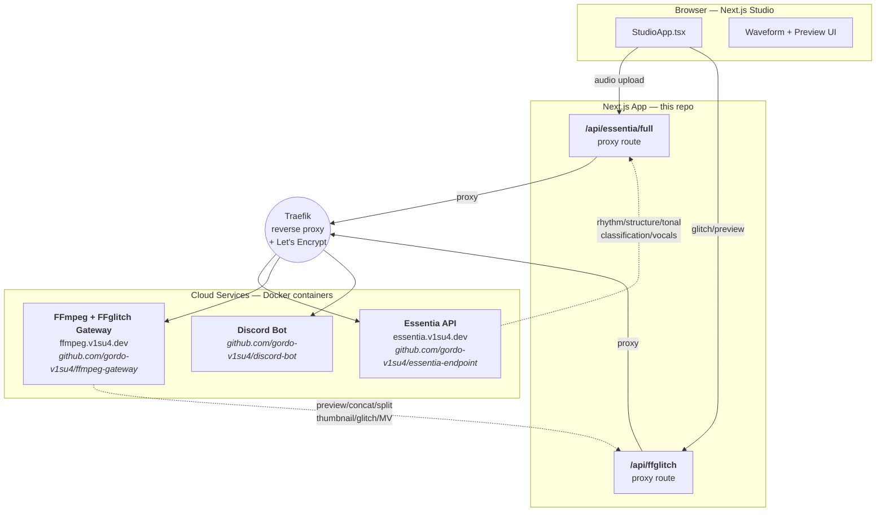

# Project Stack Structure

Smart auto music-video editor foundation built on a Next.js studio prototype.

## Current product direction
The app is being shaped around a few non-negotiable rules:
- **musical alignment first**
- **motion continuity as the default visual mode**
- **accurate segment analysis over shallow quick-scan tagging**
- **explicit recompute states over laggy pseudo-live playback**

## System architecture



### External services

| Service | URL | Repo | Stack |
|---------|-----|------|-------|
| Essentia API | `essentia.v1su4.dev` | [essentia-endpoint](https://github.com/gordo-v1su4/essentia-endpoint) | FastAPI + Essentia C++ + GPU |
| FFmpeg Gateway | `ffmpeg.v1su4.dev` | [ffmpeg-gateway](https://github.com/gordo-v1su4/ffmpeg-gateway) | FastAPI + FFmpeg + FFglitch |
| Discord Bot | — | [discord-bot](https://github.com/gordo-v1su4/discord-bot) | Bun + Express |

### FFmpeg Gateway endpoints

| Method | Path | Description |
|--------|------|-------------|
| POST | `/ffmpeg/preview` | Section preview clip |
| POST | `/ffmpeg/concat` | Concatenate segments |
| POST | `/ffmpeg/split` | Split at time boundaries |
| POST | `/ffmpeg/thumbnail` | Extract thumbnails |
| POST | `/ffmpeg/extract-audio` | Extract audio track |
| POST | `/ffmpeg/convert` | Format conversion |
| POST | `/ffglitch/glitch` | Motion vector glitch effect |
| POST | `/ffglitch/export-mv` | Export motion vectors as JSON |
| POST | `/ffglitch/replicate` | Re-encode with ffgac |
| POST | `/probe` | ffprobe media metadata |
| GET | `/health` | Service health + tool availability |
| GET | `/docs` | Swagger UI |

Full API docs: `https://ffmpeg.v1su4.dev/docs`

## Current codebase anchors
- `src/components/StudioApp.tsx` — main studio UI
- `src/components/studio/audioAnalysis.ts` — hosted audio analysis + waveform normalization
- `src/components/studio/mediaUpload.ts` — current browser-side video metadata/thumbnail preparation
- `src/components/studio/ffglitchApi.ts` — FFglitch motion vector glitch integration
- `src/components/studio/previewGeneration.ts` — FFmpeg preview + concat generation
- `src/app/api/essentia/full/route.ts` — hosted audio-analysis proxy
- `src/app/api/ffglitch/route.ts` — FFglitch capability detection + glitch proxy

## Getting started
Run the local development:

```bash
bun run build
bun run start
bun run lint
bun run test
bun run check
bun run probe:media
bun run preview:section
bun run bench:latency
bun run bench:compare -- <local-json> <remote-json>
```

## Test fixtures
Local, non-committed media fixtures live in:

```text
.local-fixtures/media/
```

The test suite and media probe script will use that directory by default. To point them somewhere else:

```bash
TEST_MEDIA_DIR=/absolute/path/to/media bun run test
```

For more detail, see `tests/README.md`.

## Canonical planning and architecture docs
- [Roadmap](docs/roadmap.md)
- [Media pipeline architecture](docs/architecture/media-pipeline.md)
- [Spec workflow protocol](docs/protocols/spec-workflow.md)
- [Latency and correctness budget](docs/protocols/latency-budget.md)
- [Implementation checklist](docs/checklists/implementation-checklist.md)
- [Local latency checkpoint](docs/benchmarks/local-latency.md)
- [Remote latency status](docs/benchmarks/remote-latency-status.md)

## Planning artifacts
- Deep interview spec: `.omx/specs/deep-interview-roadmap-spec-workflow-docs.md`
- PRD: `.omx/plans/prd-roadmap-spec-workflow-docs.md`
- Test spec: `.omx/plans/test-spec-roadmap-spec-workflow-docs.md`

## Near-term roadmap
1. Lock canonical ingest contracts
2. Define deterministic section preview behavior
3. Build ranking and fit rules around music-first joins
4. Measure whether web-first remains viable before any desktop pivot

## Notes
This repo intentionally emphasizes documentation and planning right now. The approved architecture stays **web-first** for now, while preserving a **Tauri + sidecar** contingency if browser scheduling and media constraints cannot maintain musically correct preview playback.
