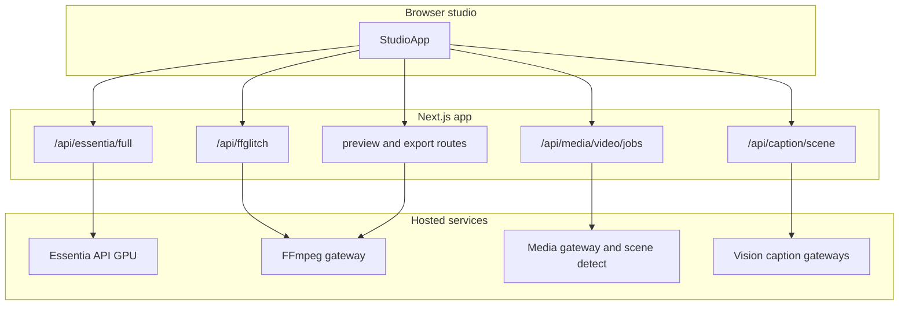

# Project Stack Structure

Smart auto music-video editor: **upload your song and footage**, get a **musically aligned rough cut**, then **optionally fill gaps** with AI-generated shots.

**Next steps:** [NEXT_STEPS.md](NEXT_STEPS.md)

## What it does

1. Analyze the **master track** (beats, sections, waveform) on a GPU-backed Essentia service.
2. Ingest **your clips** — scene detection and vision captions (LFM / Qwen VL on server GPU).
3. **Match** real footage to song sections and lyrics with motion continuity.
4. **Generate** (optional) filler shots, extensions, and bridges only where coverage is missing — via hosted APIs or local ComfyUI (integration in progress).
5. **Join** approved clips into section previews and export.

**Upload-first:** most of the edit comes from footage you already shot. AI generation is a gap-fill lane, not a replacement for your clips.

## Design rules

- **Musical alignment first** — Essentia beats and sections drive cuts.
- **Motion continuity** as the default visual mode.
- **Prepared previews** — explicit recompute states, not laggy pseudo-live playback.
- **Human approval** — Match and Join gate what enters the timeline; Generate does not silently invent shots.

## How it fits together

| Layer | Where it runs |
| --- | --- |
| Studio UI | Browser (Next.js) |
| Song analysis | Essentia API (server GPU) |
| Clip storage and scene detect | RustFS + media gateway |
| Semantic clip tagging | Vision caption gateways — LFM fast, Qwen3-VL GGUF smart (server GPU) |
| Lyrics | Deepgram (proxied) |
| Preview / export | FFmpeg gateway or local FFmpeg |
| Gap-fill video | Planned: API and/or ComfyUI sidecar |

Full detail: **[Product infrastructure](docs/architecture/product-infrastructure.md)** — workflow, hybrid model, data authority, planned clip-to-master audio sync.

## System architecture


```mermaid
graph TB
    subgraph Client["Browser studio"]
        UI[StudioApp]
    end

    subgraph NextJS["Next.js app"]
        API_E["/api/essentia/full"]
        API_F["/api/ffglitch"]
        API_C["/api/caption/scene"]
        API_M["/api/media/video/jobs"]
        API_P["preview and export routes"]
    end

    subgraph Cloud["Hosted services"]
        ESS["Essentia API GPU"]
        FFG["FFmpeg gateway"]
        MG["Media gateway and scene detect"]
        VL["Vision caption gateways"]
    end

    UI --> API_E
    UI --> API_F
    UI --> API_C
    UI --> API_M
    UI --> API_P
    API_E --> ESS
    API_F --> FFG
    API_C --> VL
    API_M --> MG
    API_P --> FFG
```

### External services

| Service | URL | Repo | Role |
| --- | --- | --- | --- |
| Essentia API | `essentia.v1su4.dev` | [essentia-endpoint](https://github.com/gordo-v1su4/essentia-endpoint) | Beats, sections, onsets, waveform |
| FFmpeg Gateway | `ffmpeg.v1su4.dev` | [ffmpeg-gateway](https://github.com/gordo-v1su4/ffmpeg-gateway) | Preview, concat, extract-audio, FFglitch |
| Media gateway | env `MEDIA_GATEWAY_URL` | — | RustFS uploads, PySceneDetect jobs |
| Vision captions | env `SCENE_CAPTION_*_GATEWAY_*` | — | LFM and Qwen3-VL scene tagging |
| Discord Bot | — | [discord-bot](https://github.com/gordo-v1su4/discord-bot) | Ops / notifications |

FFmpeg gateway API: `https://ffmpeg.v1su4.dev/docs`

## Codebase entry points

| Path | Role |
| --- | --- |
| `src/components/StudioApp.tsx` | Main studio shell |
| `src/components/studio/audioAnalysis.ts` | Essentia fetch and waveform |
| `src/components/studio/mediaUpload.ts` | Clip ingest, scene detect, captions |
| `src/components/studio/semanticEditPlanner.ts` | Lyric and story matching |
| `src/components/studio/panels/GenerateTab.tsx` | Coverage gaps and filler prompts |
| `src/app/api/essentia/full/route.ts` | Audio analysis proxy |
| `src/app/api/caption/scene/route.ts` | Vision caption proxy |
| `src/app/api/ffglitch/route.ts` | FFglitch capability/proxy route |

## Getting started

```bash
bun install
bun run dev
```

```bash
bun run build
bun run test
bun run lint
bun run check
bun run probe:media
bun run preview:section
bun run bench:latency
```

Local media fixtures (gitignored): `.local-fixtures/media/`

```bash
TEST_MEDIA_DIR=/absolute/path/to/media bun run test
```

See [tests/README.md](tests/README.md).

## Documentation

### Architecture and product

- [Product infrastructure](docs/architecture/product-infrastructure.md) — **start here** for how services and workflow connect
- [Clip audio sync](docs/architecture/clip-audio-sync.md) — align muxed clips to master timeline, lanes, phasing
- [Media pipeline](docs/architecture/media-pipeline.md) — segmentation, ranking, recompute
- [Creative production brief](docs/product/creative-production-brief.md)
- [UI workflow overhaul](docs/product/music-video-ui-workflow-overhaul.md)
- [Local SwarmUI / ComfyUI generation](docs/local-generation.md)
- [Roadmap](docs/roadmap.md)

### Protocols and benchmarks

- [Latency budget](docs/protocols/latency-budget.md)
- [Local latency checkpoint](docs/benchmarks/local-latency.md)
- [Remote latency status](docs/benchmarks/remote-latency-status.md)

## Near-term roadmap

1. Lock song / lyric / video-moment contracts
2. Harden Match and section preview
3. Wire Generate gap-fill to API or ComfyUI backends
4. Explore clip-to-master audio sync on ingest
5. Measure web-first latency before any desktop pivot

## Notes

Architecture stays **web-first** for the studio UI, with **server GPU** for analysis and tagging. A **Tauri + sidecar** path remains a contingency if browser media limits block musically correct preview.
