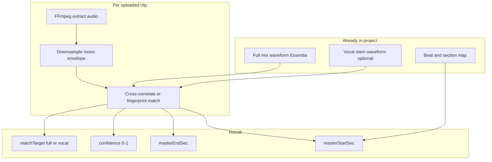
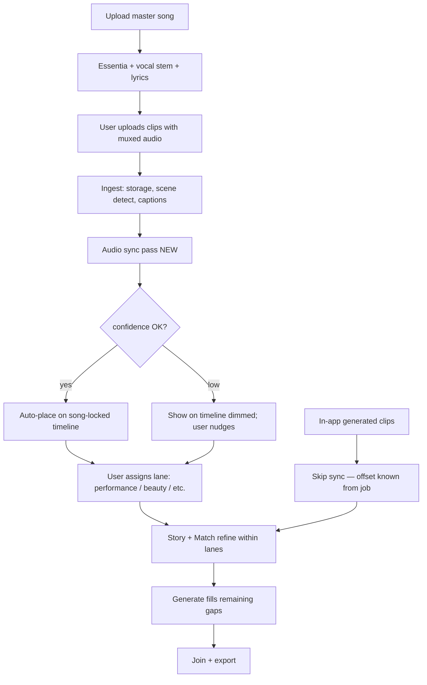

# Clip Audio Sync to Master Timeline

**Status:** Planning — not implemented  
**Audience:** Product + engineering  
**Related:** [product-infrastructure.md](./product-infrastructure.md), [media-pipeline.md](./media-pipeline.md)

---

## Problem

Users upload clips that already contain the **same master song** (full mix or isolated vocal stem) muxed into the video — often recorded while the track played, or exported from another editor with audio attached.

The app already has:

- Master song analysis (Essentia beats, sections, waveform)
- Isolated **vocal stem** + Deepgram lyric timing

We do **not** yet know **where each clip sits on the master timeline** (e.g. “this 6s take is chorus 2 starting at 1:04.2”).

Without that, Match must guess placement from semantics alone. With it, clips can **snap to the song**, land on the right **lane**, and later passes only fill **remaining** chunks.

---

## Assumptions (v1)

| Assumption | Notes |
| --- | --- |
| Same master recording | Clip audio is the same song the project analyzed — not a cover or live band |
| Muxed audio in clip | Video file has an audio track (full mix **or** vocal stem the user re-attached) |
| Encoding may differ | MP3 master vs AAC in MP4 is OK; correlation/fingerprint still works |
| Prefer stem waveform when present | If clip audio matches **vocal stem** better than full mix, use stem for alignment |
| Generated clips skip sync | Clips created in-app already carry `masterStartSec` from the generation job |

**Out of scope for v1:** silent B-roll, phone recording of a speaker, different mix with no shared stem.

---

## How it would work (technical)



### Algorithm (recommended v1)

1. **Extract** clip audio via FFmpeg gateway (`POST /ffmpeg/extract-audio`) — already exists on the gateway.
2. **Prepare reference** from master:
   - Full-mix waveform (already from Essentia ingest)
   - Vocal stem waveform (decode once when stem is uploaded / extracted)
3. **Match** clip audio to reference using **cross-correlation** on downsampled mono (e.g. 8–11 kHz) or a short **audio fingerprint** window search.
4. **Pick best target:** whichever reference (full vs vocal) yields higher correlation peak.
5. **Snap (optional):** nudge `masterStartSec` to nearest beat or lyric-chunk boundary if within tolerance (e.g. 80 ms).
6. **Store** offset + confidence on the clip / each scene segment.

**Expected accuracy:** typically 20–80 ms for clean same-master mux; flag low confidence for manual nudge.

**Complexity:** small focused module or one new API route — not a research project.

---

## Where in the codebase

| Layer | Location | Role |
| --- | --- | --- |
| **API route** | `src/app/api/sync/audio-align/route.ts` (new) | Accept clip storage ref + project master refs; return offset JSON |
| **Sync module** | `src/lib/audioAlign/` or Python sidecar | Correlation / fingerprint logic |
| **FFmpeg** | Existing FFmpeg gateway | Extract clip audio; optionally extract stem WAV if not cached |
| **Ingest hook** | `src/components/studio/mediaUpload.ts` | After RustFS upload + probe, queue sync job |
| **Data model** | `UploadedVideoSource`, `VideoMoment`, `TimelineItem` | New fields (see below) |
| **UI** | Ingest + future lane timeline | Show placement, confidence, manual override |

### Proposed fields

```typescript
// On clip or per scene segment
audioSync?: {
  masterStartSec: number;
  masterEndSec: number;       // start + clip duration (or scene duration)
  confidence: number;         // 0–1
  matchTarget: "full" | "vocal";
  snappedToBeat: boolean;
  status: "pending" | "aligned" | "low_confidence" | "failed" | "skipped";
  error?: string;
};

// Lane assignment (user or inferred)
creativeLane?: "performance" | "beauty" | "broll" | "narrative" | "unsorted";

// Timeline visibility (UX)
laneVisible?: boolean;        // default false until user confirms placement
timelineLocked?: boolean;     // locked to song grid when true
```

Persist in project export alongside existing analysis artifacts, e.g. `analysis/audio_sync/<clipId>.json`.

---

## When in the workflow

This is **not** primarily an end-of-project pass. It belongs **early**, right after upload — so Match, lanes, and Generate see grounded positions.



### Pass ordering (ironed out)

| Order | Pass | What happens |
| --- | --- | --- |
| 1 | **Master ingest** | Song + stem + Essentia + Deepgram — *already done today* |
| 2 | **Clip ingest** | Upload, scene split, VL captions — *partially done* |
| 3 | **Audio sync** | Align each muxed clip to master — **new, runs here** |
| 4 | **Lane tagging** | User marks performance / beauty / B-roll (or infer from caption `shotType`) |
| 5 | **Timeline placement** | Clips appear on song grid; **off by default or dimmed** until user confirms |
| 6 | **Match** | Semantic + motion ranking **within** lane and time window — not global guess |
| 7 | **Generate** | Only **unoccupied** chunks; performance lane uses vocal windows |
| 8 | **Join / export** | Stack lanes; performance wins on vocal moments if overlap |

### Why not only at the end?

- Users often upload **some** footage first (middle or opening shots), then **generate** the rest in-app.
- Early sync means those uploads **anchor** the edit immediately.
- End-of-project “beauty + singing fixes” are **new** clips with **known** timing from Generate — they skip sync.
- A late **re-sync** pass could still run as **QA** (verify drift) but should not be the first placement.

### Typical creator pattern you described

| Clip source | When added | Sync needed? |
| --- | --- | --- |
| User uploads with track/stem baked in | Beginning or middle of session | **Yes — ingest sync pass** |
| Performance / beauty generated in app | Toward end | **No — job supplies `masterStartSec`** |
| Vocal stem on master | Up front | **Already extracted** — used as reference, not re-synced |

---

## Lanes, visibility, and “locked to the song”

### Creative lanes (UI concept)

| Lane | Placement hint after sync |
| --- | --- |
| **Performance** | Prefer intervals where **vocal stem / lyric chunks** are active; lip-sync priority |
| **Beauty / hero** | Same section windows; avoid stealing vocal peaks from performance |
| **B-roll** | Fill non-vocal or low-energy regions |
| **Generated fill** | Only empty regions after real lanes placed |

### UX ideas (aligned with your thinking)

1. **Song-locked timeline** — one master waveform; all lanes scroll/zoom together.
2. **Clips land muted/dimmed** after auto-sync until user toggles **visible** or **approved**.
3. **Lane toggle** — turn performance lane off to preview beauty-only rough cut.
4. **Drag override** — user can nudge clip; optional re-snap to beat.
5. **Lock** — once approved, clip `timelineLocked: true` so Match doesn’t move it without unlock.

Generate tab’s Track A/B/C/D today is **material type** (real vs AI). Lanes above are **creative role**. Both can coexist: lane = *what*; track = *source*.

---

## Performance lane + vocal stem

The isolated vocal stem is the **reference map** for performance footage:

- Deepgram already gives **when words happen**.
- Vocal stem waveform gives **where energy exists** even between words.
- After sync, a performance clip at `masterStartSec` can be checked: *does this overlap a vocal window?* If not, warn or suggest moving.

Generated performance clips (with audio conditioning) are created **on purpose** for a lyric window — no sync pass needed.

---

## Phasing

| Phase | Deliverable | User-visible |
| --- | --- | --- |
| **P0 — Spike** | CLI or API: given master + one clip, return offset + confidence | Dev only |
| **P1 — Ingest** | Auto-run on upload; store on `UploadedVideoSource` | Badge on clip: “Aligned @ 1:04” / “Needs review” |
| **P2 — Timeline** | Show clips on master grid; dim until approved | Drag/nudge + snap |
| **P3 — Lanes** | Performance / beauty tags; vocal-window validation | Lane toggles |
| **P4 — Match integration** | Match respects `masterStartSec` + lane | Fewer wrong assignments |
| **P5 — Generate integration** | Gap map excludes occupied regions | Smarter fillers |

**Suggested roadmap slot:** **P1 after Match hardening**, **before** Generate backend wiring — uploaded anchors should be stable before AI fill.

---

## What to do with this information now

| Action | Priority |
| --- | --- |
| Keep this doc as the contract for sync + lanes | Now |
| Add P0 spike task to roadmap (ffmpeg extract + correlate script) | When ready to build |
| Do **not** block current Match/Story work | Sync is additive |
| When implementing ingest UI, leave hooks for `audioSync.status` | Low cost now |

No code is required to **validate the idea** — same-master muxed audio alignment is standard. The product decision is **when**: ingest placement (recommended), not export-only.

---

## Open questions

1. **Per-clip vs per-scene-segment sync** — long file with multiple takes may need segment-level correlation; start per-file, split later if scene detect finds hard cuts.
2. **Stem-only clips** — correlate against vocal stem only; full mix clips against full + vocal pick-best.
3. **Replace clip audio on export?** — performance lane might mute clip audio and use master mix; policy for Join/export TBD.
4. **Re-upload** — invalidate sync when master song changes.

---

## Related documentation

- [Product infrastructure](./product-infrastructure.md) — hybrid services and workflow
- [Media pipeline](./media-pipeline.md) — ingest and segment planes
- [Roadmap](../roadmap.md) — gap-fill after Match
