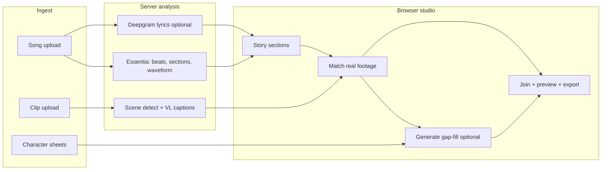

# Product Infrastructure

How the smart auto music-video editor is assembled: what runs where, what the user supplies, and what the server does.

For pipeline contracts and ranking rules, see [media-pipeline.md](./media-pipeline.md). For product vision, see [creative-production-brief.md](../product/creative-production-brief.md).

---

## Product model (one paragraph)

The user uploads a **song** and **their own footage** (plus optional character sheets). The app analyzes music structure, understands each clip, and builds a **musically aligned rough cut** from real shots first. Where footage does not cover the edit, the **Generate** lane suggests **fillers** — B-roll, extensions, bridges, alt angles — via hosted APIs or local ComfyUI. The browser is the studio; heavy analysis runs on **GPU-backed services** you operate.

---

## How a project flows



| Stage | User action | System behavior |
| --- | --- | --- |
| **Ingest** | Upload song, clips, reference sheets | Probe media, store clips, start scene jobs |
| **Analyze** | (automatic) | Essentia on master track; PySceneDetect + vision captions per clip; optional vocal transcript |
| **Story** | Edit section prompts, lyrics | Build `MusicVideoProject` with song sections and lyric chunks |
| **Match** | Review assignments | Rank **uploaded** moments to sections by music, lyrics, motion continuity |
| **Generate** | Fill gaps only | Coverage map: missing / weak / short slots → prompt drafts → API or ComfyUI (wiring in progress) |
| **Join** | Approve timeline | Concat section previews; optional effects; export |

**Non-negotiable:** Match and Join use **approved** footage. Generate does not silently invent shots.

---

## Hybrid execution: browser vs server

| Layer | Runs where | Role |
| --- | --- | --- |
| Studio UI | Browser (Next.js) | Workflow, preview player, edit decisions |
| Audio analysis | Essentia API (GPU server) | Beats, onsets, sections, energy, waveform |
| Video storage | RustFS via media gateway | Uploads, scene-detect jobs |
| Scene detection | Media gateway worker | PySceneDetect adaptive splits |
| Vision captions | Caption gateways (GPU server) | Fast: LFM-2.5-VL; Smart: Qwen3-VL GGUF |
| Transcription | Deepgram (proxied) | Vocal stem → timed lyrics |
| Preview / export | Local FFmpeg or FFmpeg gateway | Section concat, glitch, final MP4 |
| Gap-fill generation | Planned: hosted APIs **or** user ComfyUI | Keyframes / I2V for coverage slots only |
| Shader preview | Browser WebGPU | Beat-synced effects (no server GPU) |

The product is **web-first in the UI**, not "no server compute." Semantic tagging and VL analysis depend on **NVIDIA GPU services** behind Next.js proxy routes.

---

## Data the system trusts

| Source | Authoritative for |
| --- | --- |
| Essentia (master song) | Beat grid, sections, onsets, duration, waveform |
| Deepgram / SRT | Lyric text and timestamps |
| Scene captions (LFM / Qwen) | Visible content of each clip segment |
| Motion descriptors | Continuity scoring between joins |
| User section prompts | Creative intent per song section |
| Match scores | Which **existing** moment fits which slot |
| Generate coverage | What's missing and what kind of filler is needed |

LLM output is **not** authoritative for musical timing. It proposes prompts and treatments; the user applies changes.

---

## Upload-first, generate-to-fill

Most timeline slots should come from **user-uploaded clips**. That fits creators who already have ideas, character sheets, and partial shoots.

**Generate** exists for the "I don't know what comes next" moment:

- Surfaces **gaps** on the song timeline (missing, weak match, too short)
- Suggests filler types: B-roll, alt angle, extend first/last frame, bridge A→B
- Drafts prompts from story intent + neighbor clip captions + reference sheets
- Queues generation only after user review (API video or local ComfyUI — integration planned)

This is **not** a full AI music-video generator by default. The product optimizes for **placing real footage correctly**, then **optional** AI gap-fill.

---

## Planned: clip audio sync to master

**Status:** Planning doc available — [clip-audio-sync.md](./clip-audio-sync.md)

When clips contain the same master track (full mix or vocal stem muxed in), extract clip audio and align to the project waveform to get `masterStartSec` + confidence. Runs on **upload ingest**, not at export. Generated in-app clips skip sync (offset known from the job). Enables song-locked lanes (performance, beauty, B-roll) and smarter gap-fill.


---

## Architecture diagram (services)

```mermaid
graph TB
    subgraph Client["Browser studio"]
        UI[StudioApp]
    end

    subgraph App["Next.js app"]
        E[/api/essentia/full]
        F[/api/ffglitch]
        C[/api/caption/scene]
        M[/api/media/video/jobs]
        D[/api/deepgram/transcribe]
        P[/api/preview and export]
    end

    subgraph Cloud["Hosted services"]
        ESS[Essentia API GPU]
        FF[FFmpeg gateway]
        MG[Media gateway RustFS plus scene detect]
        VL[Vision caption gateways LFM and Qwen VL]
        DG[Deepgram]
    end

    subgraph Planned["Planned gap-fill"]
        API[Hosted image and video APIs]
        COMFY[Local or remote ComfyUI]
    end

    UI --> App
    E --> ESS
    F --> FF
    C --> VL
    M --> MG
    D --> DG
    P --> FF
    UI -.-> API
    UI -.-> COMFY
```

---

## Environment routing

Proxy routes read env vars and fall back to local tools where configured. Common variables:

| Variable family | Purpose |
| --- | --- |
| `NEXT_PUBLIC_ESSENTIA_API_*` | Direct or proxied Essentia |
| `FFMPEG_GATEWAY_URL` | Cloud concat, preview, extract-audio |
| `MEDIA_GATEWAY_URL` | RustFS upload, scene-detect jobs |
| `SCENE_CAPTION_*_GATEWAY_*` | Fast and smart VL caption servers |
| `FFMPEG_PATH` | Local FFmpeg fallback |

See route files under `src/app/api/` for exact names.

---

## Related documentation

| Doc | Contents |
| --- | --- |
| [clip-audio-sync.md](./clip-audio-sync.md) | Align uploaded clips to master timeline; lanes and phasing |
| [media-pipeline.md](./media-pipeline.md) | Segmentation, motion ranking, recompute states |
| [creative-production-brief.md](../product/creative-production-brief.md) | Full product vision and donor map |
| [music-video-ui-workflow-overhaul.md](../product/music-video-ui-workflow-overhaul.md) | Studio tab workflow |
| [../../README.md](../../README.md) | Repo entry point and quick start |
