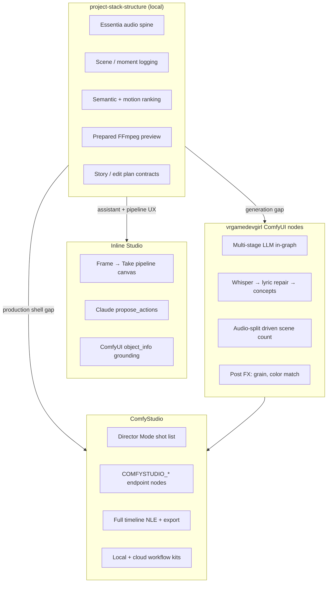

# Comparative Research Index

**Project:** `project-stack-structure` — web-first smart auto music-video editor  
**Date:** June 27, 2026  
**Purpose:** Planning reference comparing the local codebase with three external repos that represent different layers of the music-video / ComfyUI production stack.

**Status:** Complete — all nine documents in this folder (June 27, 2026).

---

## What this folder is

These documents synthesize:

1. **Local brownfield** — what `project-stack-structure` already does well and where it is intentionally different.
2. **Inline Studio** — pipeline experimentation canvas + Claude assistant + ComfyUI bridge (MIT, Electron).
3. **comfyui-vrgamedevgirl** (`dev/music-video-builder-ui-test-v9`) — ComfyUI-native music video automation: LLM prompt chains, audio splitting, HUMO/LTX workflows, in-graph UI (AGPL-3.0).
4. **ComfyStudio** — desktop NLE + Director Mode + ComfyUI endpoint injection + cloud/local workflow registry (MIT, Electron).

**This is planning only.** No application code changes are implied by these files.

---

## Reference clone locations

Shallow clones used for this research live under:

```text
.research/inline-studio/
.research/comfyui-vrgamedevgirl/   # branch: dev/music-video-builder-ui-test-v9
.research/comfystudio/
```

Note: the user-requested branch name `test_v9` maps to `dev/music-video-builder-ui-test-v9` on the remote. Verified on clone at commit `1676f53`.

Public VRGDG docs may reference v8 imagery; v9 extends the same Video Builder + Prompt Creator model with updated LLM model lists.

---

## Document map

| File | One-line description |
|------|----------------------|
| [local-codebase-summary.md](./local-codebase-summary.md) | Architecture, contracts, and strengths of the active Next.js studio |
| [inline-studio-analysis.md](./inline-studio-analysis.md) | Moodboard pipeline model, Claude tooling, ComfyUI capability grounding |
| [vrgamedevgirl-comfyui-analysis.md](./vrgamedevgirl-comfyui-analysis.md) | In-graph LLM chains, lyric repair, prompt creator, video builder UI |
| [comfystudio-analysis.md](./comfystudio-analysis.md) | Director Mode, shot taxonomy, timeline assembly, workflow registry |
| [cross-repo-comparison.md](./cross-repo-comparison.md) | Side-by-side matrix across prompt, backend, execution, UX, architecture |
| [recommended-improvements-prompt-engineering.md](./recommended-improvements-prompt-engineering.md) | Actionable prompt/LLM patterns to adopt or adapt locally |
| [recommended-improvements-comfyui-backend.md](./recommended-improvements-comfyui-backend.md) | ComfyUI integration patterns: API, queue, workflows, custom nodes |
| [recommended-workflow-changes.md](./recommended-workflow-changes.md) | End-to-end music-video workflow changes for the local product |
| [where-we-are-stronger.md](./where-we-are-stronger.md) | Honest assessment of local advantages over each reference |

---

## Executive synthesis



### Layering insight

| Layer | Best reference | Local status |
|-------|----------------|--------------|
| **Musical truth** (beats, sections, onsets) | Local Essentia spine | **Strong — product differentiator** |
| **Footage truth** (scenes, motion, captions) | Local + review-room patterns | **Strong and improving** |
| **Semantic match** (lyrics ↔ visuals) | Local `semanticEditPlanner` | **Good for existing footage; weak for T2V** |
| **Generative shot planning** | ComfyStudio Director Mode + VRGDG Prompt Creator | **Not built locally** |
| **Generative render** | ComfyUI workflows (all three refs) | **Not integrated locally** |
| **Finish edit / export** | ComfyStudio timeline | **Partial (export route exists; not full NLE)** |

### Recommended integration stance

1. **Keep the local product class:** music-first auto editor for user-supplied clips — not a ComfyUI wrapper.
2. **Borrow generative patterns as optional lanes:** shot-list + keyframe generation for gaps in footage coverage.
3. **Do not copy ComfyStudio's full NLE scope** until the core "musically correct rough cut from existing clips" milestone is proven.
4. **Treat VRGDG nodes as workflow donors**, mindful of **AGPL-3.0** if embedded in a hosted product.
5. **Adopt Inline Studio's capability-grounding pattern** before any LLM writes ComfyUI JSON.

---

## How to use these docs

**For product planning:** start with [cross-repo-comparison.md](./cross-repo-comparison.md) and [recommended-workflow-changes.md](./recommended-workflow-changes.md).

**For ComfyUI integration design:** read [recommended-improvements-comfyui-backend.md](./recommended-improvements-comfyui-backend.md) after [comfystudio-analysis.md](./comfystudio-analysis.md) and [vrgamedevgirl-comfyui-analysis.md](./vrgamedevgirl-comfyui-analysis.md).

**For LLM / prompt pipeline design:** read [recommended-improvements-prompt-engineering.md](./recommended-improvements-prompt-engineering.md) with [inline-studio-analysis.md](./inline-studio-analysis.md).

**For morale / scope control:** read [where-we-are-stronger.md](./where-we-are-stronger.md) before assuming the references are strictly ahead.

---

## Related local canonical docs

- [Creative production brief](../../docs/product/creative-production-brief.md)
- [Roadmap](../../docs/roadmap.md)
- [Media pipeline architecture](../../docs/architecture/media-pipeline.md)
- [README](../../README.md)

---

## Uploaded reference captures

- `uploads/comfyui-vrgamedevgirl.git-0.md` — GitHub README scrape (main branch overview)
- `uploads/comfystudio.git-1.md` — GitHub README scrape (feature overview)

These were supplemented by shallow git clones for branch-accurate analysis (especially VRGDG v9).
