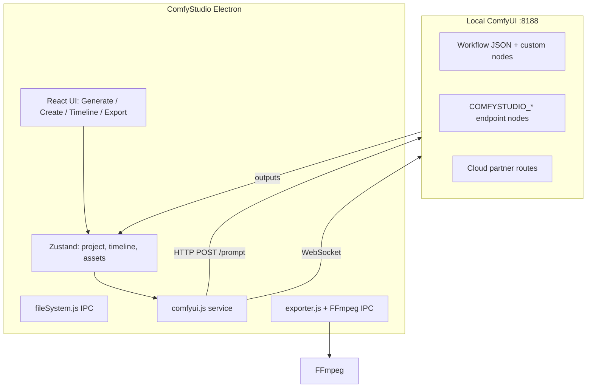

# ComfyStudio Analysis

**Repo:** [JaimeIsMe/comfystudio](https://github.com/JaimeIsMe/comfystudio)  
**License:** MIT  
**Stack:** Electron + React (Vite) + Zustand + FFmpeg IPC + ComfyUI HTTP/WebSocket  
**Website:** [comfystudiopro.com](https://comfystudiopro.com)  
**Clone:** `.research/comfystudio/`

---

## What ComfyStudio is

A **desktop AI video workstation** — DaVinci Resolve-inspired UI wrapping ComfyUI for generation, asset management, timeline editing, captions, effects, and export.

Positioning (README):

> ComfyStudio is not a replacement for ComfyUI. It is the production layer around ComfyUI: plan the work, send jobs to ComfyUI, collect the outputs, and finish the edit.

**Closest overlap with local project:** music-video **planning** (lyrics, shots, timing) + **assembly** — but ComfyStudio assumes **generative shots** as the default path.

---

## Architecture



### Project folder contract

```text
MyProject/
├── project.comfystudio    # timeline, assets, settings JSON
├── assets/video|audio|images/
├── cache/                 # playback + render cache
├── renders/
└── autosave/
```

Portable, single-folder projects — similar spirit to Inline `.inlinestudio` export.

---

## ComfyUI integration (deepest reference for local backend design)

### Connection defaults

- Endpoint: `http://127.0.0.1:8188` (localhost only in desktop app)
- Optional auto-start launcher (Windows script / macOS `.app`)
- CORS required for embedded tab
- Comfy account login for partner/credit workflows

### Workflow execution (`src/services/comfyui.js`)

Central service responsibilities:

- Load workflow JSON from `public/workflows/`
- **Modifier functions** per workflow ID — patch prompts, seeds, dimensions, input images, audio paths
- Upload assets to ComfyUI input dir
- Queue prompt, poll `/history`, WebSocket progress
- Download images/videos/gifs outputs back to project assets

Example modifiers referenced in PROJECT_SUMMARY:

- `modifyLTX2I2VWorkflow`, `modifyLTX2T2VWorkflow`
- `modifyWAN22I2VWorkflow`
- `modifyQwenImageEdit2509Workflow`
- `modifyMusicWorkflow`
- **`modifyMusicVideoShotWorkflow`** — Director Mode shot → node inputs

### ComfyStudio Bridge / endpoint nodes

Custom ComfyUI nodes (installed separately) expose injection points:

| Node | Injected by app |
|------|-----------------|
| `COMFYSTUDIO_INPUT_IMAGE` | Reference still |
| `COMFYSTUDIO_PROMPT` | Text prompt |
| `COMFYSTUDIO_SEED` | Seed |
| `COMFYSTUDIO_WIDTH/HEIGHT/FPS/DURATION` | Video params |
| `COMFYSTUDIO_AUDIO` | Audio segment |
| `COMFYSTUDIO_OUTPUT_IMAGE/VIDEO` | Capture outputs |

**Pattern:** graph authors keep creative freedom; app only overrides wired endpoints. **Highly adoptable** for local optional ComfyUI lane.

### Workflow registry & dependency packs

Files:

- `src/config/workflowRegistry.js`
- `src/config/workflowSetupGallery.js`
- `src/config/workflowDependencyPacks.js`

Features:

- Setup checks for missing nodes/models/credentials
- **Music Video Kit** bundle: vocal extract, ASR captions, Nano Banana 2, LTX 2.3 shot workflow
- Human-readable workflow descriptions in gallery

### Job queue UX

`GenerateWorkspace.jsx`:

- Sticky progress strip (WebSocket + polling fallback)
- Multi-job queue with import-to-assets on complete
- Handles ComfyUI output quirks (`gifs` vs `videos` keys)

---

## Music Video Creation / Director Mode

Primary music-video reference within ComfyStudio.

### Config spine: `src/config/musicVideoShotConfig.js`

This file is the **shared contract** between planner and ComfyUI modifier — worth studying as a template.

#### Shot type taxonomy

| ID | Purpose |
|----|---------|
| `performance` | Close lip-sync; talking-head LoRA on |
| `performance_wide` | Wide performance; softer lip-sync |
| `b_roll` | Cutaways; no lip-sync |

Each type carries: LoRA flags, `promptSuffix`, `needsVocalAlignment`, default image strength.

#### Creative presets

- `performance`, `narrative`, `vibes`, `tour_diary`
- Control b-roll ratio, avg shot length, narrative intensity

#### Director script grammar

Structured text shots:

```text
Shot N: Title
Start at: 0:00
Shot type: performance | b_roll | ...
Artist: rose | jake | both
Lyric moment: "quoted line"
Keyframe prompt: ...
Motion prompt: ...
Camera: ...
Length: 3
```

Template provided as `MUSIC_VIDEO_SCRIPT_TEMPLATE`.

#### Timing ownership (Phase 8 design)

Priority order:

1. **`Start at:` in script** (authoritative)
2. **SRT/LRC parsed timings** (`parseTimedLyrics`)
3. **Lyric moment fuzzy match** → timed line lookup
4. **Linear estimation** across pasted lyrics (last resort)

**Local parallel:** local project uses Essentia sections + SRT chunks — ComfyStudio's timed-lyrics parser is a **donor for Story tab** if generative shots are added.

#### Audio kinds

| Kind | Behavior |
|------|----------|
| `mixed_track` | Run vocal extraction once (Mel-Band RoFormer workflow) |
| `vocal_stem` | Pass through |
| `instrumental` | Disable lip-sync; b-roll bias |

Workflow IDs:

- `music-video-shot-ltx23` — per-shot LTX 2.3 audio-conditioned render
- `vocal-extract-melband` — preprocessing

#### Cast roster + lyric tags

- `[Rose]` / `[Jake]` sticky tags in lyrics
- `Artist:` field in shots
- Slug normalization + collective keywords (`both`, `all`, `band`)

---

## Create workspace modes

Beyond music video:

- **UGC Creator** — hooks, product demos, shot plans
- **Business Ad Creator** — offer-first ads
- **Short Film Creation** — beta script-to-scene

Shared **Director Mode engine** — music video is the most mature for timing + audio conditioning.

---

## Timeline / NLE layer

ComfyStudio is ~95% a full editor (per PROJECT_SUMMARY):

| Feature | Notes |
|---------|-------|
| Multi-track timeline | Video + audio, ripple, roll, slip edits |
| Transitions | Resolve-style tiles, multiple types |
| Keyframes | Transform, blur, crop with easing |
| Text clips | Lower thirds, captions |
| Playback cache | Flame-style transcode on import |
| Export | PNG sequence + FFmpeg NVENC/ProRes |
| Captions | Timeline-aware transcription + styles |
| MoGraph | Beta motion graphics presets |
| Flow AI | Node canvas chaining generation steps |

**Local gap:** this is the largest UX surface ComfyStudio has that local project explicitly excludes from MVP.

---

## Prompt engineering in ComfyStudio

Unlike VRGDG's in-graph multi-LLM chain, ComfyStudio emphasizes:

1. **Human-authored director scripts** with optional LLM assist (`google-gemini-flash-lite` workflow for prompt cleanup)
2. **Structured shot objects** → deterministic prompt suffixes from shot type
3. **Separate keyframe vs motion prompts** per shot
4. **Style cards** (`neon-noir`, `warm-35mm`, etc.) as reusable strings

LLM role is often **assistive** (enhance prompt, plan shots via YOLO planning utils) rather than fully autonomous end-to-end.

Files:

- `src/utils/yoloPlanning.js` — shot list planning helpers
- `src/components/generate/MusicVideoEasyMode.jsx` — simplified MV UX
- `src/config/shortFilmConfig.js` — parallel pattern for dialogue motion prompts

---

## Local vs hybrid vs cloud execution

| Lane | ComfyStudio support |
|------|---------------------|
| Local ComfyUI | Primary — LTX, WAN, Qwen, ACE-Step music |
| Cloud partner | Nano Banana 2, GPT Image 2, Seedance, Kling, Gemini helper |
| Hybrid | User choice per workflow in Generate tab |

README: heavy video workflows may need **24GB+ VRAM** locally; cloud shifts compute to provider credits.

**Local project parallel:** already hybrid via Essentia + FFmpeg cloud gateways — ComfyUI would be a **third optional remote/local lane**.

---

## UI/UX for creators

| Strength | Tradeoff |
|----------|----------|
| Resolve-familiar layout lowers NLE learning curve | Heavy Electron app, not web-first |
| Music Video Kit onboarding | Requires separate ComfyUI setup |
| Asset browser with AI/IMP badges | Two apps to maintain (ComfyStudio + ComfyUI) |
| Live drop preview on timeline | Complexity far beyond local MVP |

For local web studio: borrow **director script grammar** and **shot review cards**, not entire timeline.

---

## Patterns to adopt locally

1. **`musicVideoShotConfig`-style shared contract** between planner and backend modifier.
2. **Endpoint node pattern** (or JSON path injection map) for custom workflows.
3. **Workflow registry + setup gallery** with missing-dependency diagnostics.
4. **Timed lyrics parser** (SRT/LRC) unified with Story tab.
5. **Vocal preprocess once per project** before per-shot audio conditioning.
6. **Shot type taxonomy** mapping to prompt suffixes and lip-sync requirements.
7. **Music Video Kit** concept as optional setup checklist in docs/settings.

## Patterns to avoid (for current MVP)

1. Full multi-track NLE before musical rough cut proven.
2. Electron-first delivery (conflicts with web-first evidence policy).
3. Bundling 20+ workflows before one shot workflow is reliable.

---

## Key files

| Path | Purpose |
|------|---------|
| `src/config/musicVideoShotConfig.js` | Shot/timing/cast contract |
| `src/services/comfyui.js` | Queue, modifiers, uploads |
| `src/components/GenerateWorkspace.jsx` | Job queue + MV assembly |
| `src/components/generate/MusicVideoEasyMode.jsx` | Simplified MV UI |
| `public/workflows/*.json` | Workflow templates |
| `PROJECT_SUMMARY.md` | Exhaustive feature inventory |
| `README.md` | User-facing feature list |
