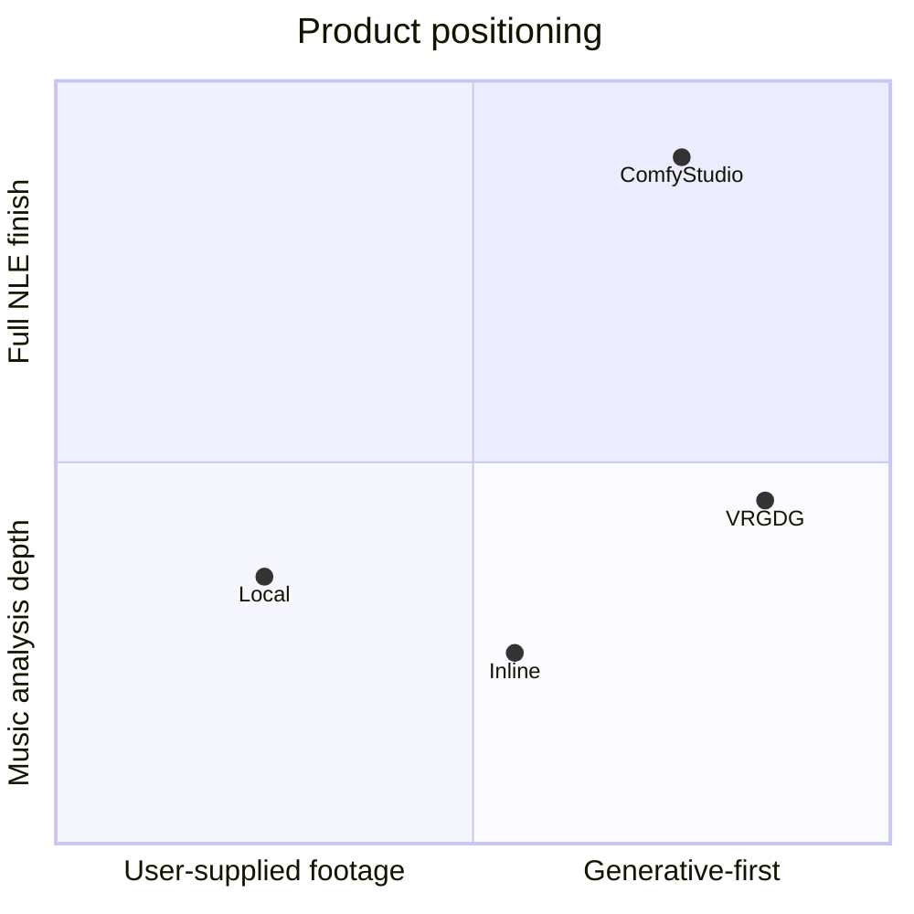
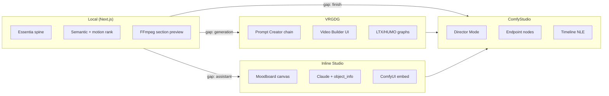
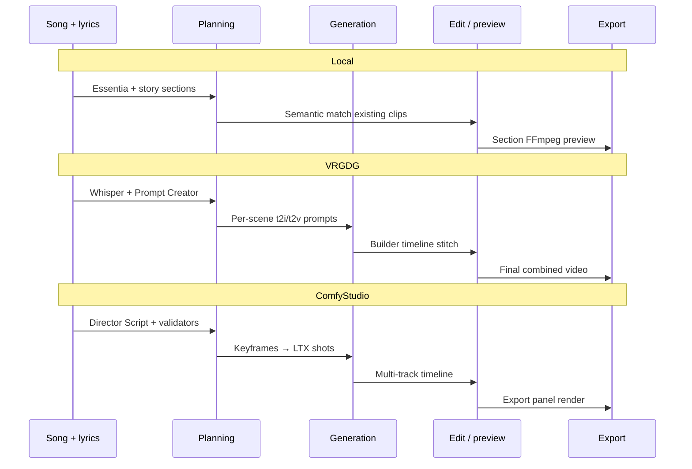

# Cross-Repo Comparison

**Date:** June 27, 2026  
**Repos compared:**

| ID | Repo | Branch / note |
|----|------|---------------|
| **Local** | `project-stack-structure` | Active product |
| **Inline** | Inline Studio | `main` |
| **VRGDG** | comfyui-vrgamedevgirl | `dev/music-video-builder-ui-test-v9` |
| **CS** | ComfyStudio | `main` |

---

## Product class at a glance

| Dimension | Local | Inline | VRGDG | ComfyStudio |
|-----------|-------|--------|-------|-------------|
| **Primary user** | Editor with existing clips | ComfyUI artist experimenting | AI MV creator in ComfyUI | Creator finishing in NLE |
| **Default path** | Rank + preview existing footage | Canvas → Take per frame | Generate full MV from audio | Director script → render → timeline |
| **ComfyUI role** | None today | Embedded + bridge pull | Entire backend | Queue + endpoint injection |
| **Musical spine** | Essentia (authoritative) | None | Audio split + SRT/Whisper | SRT/LRC + validators |
| **LLM role** | Optional captions; deterministic match | Claude assistant + workflow JSON | Multi-stage in-graph Gemma chain | External LLM → Director Script |
| **Timeline** | Section preview (FFmpeg) | In-node Video Director | Builder bottom timeline | Full multi-track NLE |
| **License** | Project | MIT | **AGPL-3.0** | MIT |

---

## Capability matrix

### Musical analysis and timing

| Capability | Local | Inline | VRGDG | ComfyStudio |
|------------|:-----:|:------:|:-----:|:-----------:|
| Beat/onset/section analysis | ✅ Essentia | ❌ | ⚠️ beat snap in builder | ⚠️ via song duration + SRT |
| Downbeat-aware cuts | ✅ | ❌ | ⚠️ | ⚠️ |
| Energy curve | ✅ | ❌ | ❌ | ❌ |
| Lyric chunk alignment | ✅ Deepgram/SRT | ❌ | ✅ Whisper + repair | ✅ SRT/LRC parser |
| Audio-split scene count | ❌ | ❌ | ✅ | ⚠️ shot length presets |
| Timing validation (coverage/drift) | ⚠️ partial | ❌ | ⚠️ manual | ✅ plan validators |

### Footage understanding

| Capability | Local | Inline | VRGDG | ComfyStudio |
|------------|:-----:|:------:|:-----:|:-----------:|
| Scene detection | ✅ | ❌ | ❌ | ❌ |
| Segment-level captions | ✅ LFM | ❌ | ❌ | ⚠️ ASR on song |
| Motion descriptors | ✅ typed contract | ❌ | ❌ | ❌ |
| Semantic ↔ lyric match | ✅ deterministic | ❌ | ⚠️ in prompts only | ⚠️ in director script |
| Motion continuity ranking | ✅ tested policy | ❌ | ❌ | ❌ |
| Coverage gap detection | ✅ Generate tab | ❌ | ❌ | ⚠️ implicit in planning |

### Generative pipeline

| Capability | Local | Inline | VRGDG | ComfyStudio |
|------------|:-----:|:------:|:-----:|:-----------:|
| ComfyUI integration | ❌ | ✅ bridge | ✅ native | ✅ queue + launcher |
| Multi-stage LLM prompts | ❌ | ⚠️ Claude tools | ✅ Prompt Creator | ✅ Director Mode |
| Keyframe generation | ❌ shell | ✅ per frame | ✅ per scene | ✅ per shot |
| I2V / lip-sync | ❌ | ⚠️ user graph | ✅ LTX/HUMO | ✅ LTX 2.3 shot workflow |
| Post FX (grain, color) | ⚠️ FFglitch | ❌ | ✅ in-graph | ⚠️ timeline effects |
| Cloud model routes | ❌ | ❌ | ❌ | ✅ Kling, Grok, etc. |

### UX and production

| Capability | Local | Inline | VRGDG | ComfyStudio |
|------------|:-----:|:------:|:-----:|:-----------:|
| Web-first | ✅ | ❌ Electron | ❌ ComfyUI web | ⚠️ Electron primary |
| Prepared preview states | ✅ stale/ready | ❌ | ❌ | ⚠️ proxy cache |
| Propose-then-apply LLM | ❌ | ✅ | ⚠️ Agent | ❌ paste script |
| Portable project bundle | ⚠️ contracts | ✅ .inlinestudio | ✅ output folder | ✅ .comfystudio |
| Full NLE export | ⚠️ partial | ⚠️ in-node | ⚠️ stitch | ✅ |
| Review / approval UX | ✅ review room | ❌ | ❌ | ⚠️ asset browser |

Legend: ✅ strong · ⚠️ partial · ❌ absent

---

## Architecture comparison

### Integration boundary patterns

| Pattern | Best example | Description |
|---------|--------------|-------------|
| Engine isolation | Inline `electron/main/comfy/` | All Comfy knowledge in one module |
| Capability grounding | Inline `/object_info` before LLM | No invented node names |
| Endpoint injection | ComfyStudio `COMFYSTUDIO_*` titles | App writes shot params into user graphs |
| In-graph app shell | VRGDG Video Builder | Full UI inside ComfyUI node |
| Folder project | All three refs | JSON manifest + assets + workflows |
| External LLM clipboard | ComfyStudio Copy LLM Prompt | Format-controlled handoff |

---

## Prompt engineering comparison

| Aspect | Local | Inline | VRGDG | ComfyStudio |
|--------|-------|--------|-------|-------------|
| **Trigger** | Section story prompts | User chat | Prompt Creator batch | Copy LLM Prompt |
| **Stages** | 1 (caption) + rank | 1–2 (guidance + graph) | 5+ (repair→concepts→motion) | 2 (LLM script → parse) |
| **Ground truth** | Captions + lyrics | object_info | Whisper segments | SRT/LRC |
| **Validation** | Unit tests on rank | User apply click | JSON repair + segment count | Coverage/overlap/drift |
| **Output artifact** | EditPlan JSON | Workflow JSON | t2i/t2v maps + SRT | Shot list + timeline |

---

## ComfyUI backend comparison

| Aspect | Inline | VRGDG | ComfyStudio |
|--------|--------|-------|-------------|
| Queue orchestration | Minimal (human runs graph) | Builder triggers API JSON | Full `/prompt` + WS |
| Workflow source | User + Claude suggest | Bundled MVC graphs | Registry + custom import |
| Custom node dep | None (user install) | VRGDG pack required | Bridge + optional nodes |
| Output handling | Pull history → Take | Project folder | Auto-import → assets |
| Setup validation | Capability ping | Model download UI | Missing node/model check |

Local: **no ComfyUI layer today** — Generate tab is UI shell over coverage slots.

---

## Music-video workflow comparison

---

## Strategic layering (recommended)

| Layer | Owner | Reference to borrow from |
|-------|-------|--------------------------|
| Musical truth | **Local (keep)** | — |
| Footage librarian + rank | **Local (keep)** | — |
| Coverage gap UX | **Local (extend)** | ComfyStudio shot types |
| Generative shot prompts | **Optional lane** | VRGDG stages + CS Director format |
| ComfyUI execution | **Sidecar** | CS queue + Inline grounding |
| Full NLE finish | **Defer** | ComfyStudio (post-MVP) |

---

## Risk and license summary

| Repo | Risk if embedded in hosted SaaS |
|------|----------------------------------|
| Inline | Low (MIT) — patterns safe |
| ComfyStudio | Low (MIT) — patterns safe |
| VRGDG | **High (AGPL-3.0)** — reimplement patterns; user-run ComfyUI only |
| Local | N/A — product source of truth |

---

## Where to read next

| Question | Document |
|----------|----------|
| What should we build first? | [recommended-workflow-changes.md](./recommended-workflow-changes.md) |
| LLM/prompt patterns | [recommended-improvements-prompt-engineering.md](./recommended-improvements-prompt-engineering.md) |
| ComfyUI API design | [recommended-improvements-comfyui-backend.md](./recommended-improvements-comfyui-backend.md) |
| Why not panic | [where-we-are-stronger.md](./where-we-are-stronger.md) |
