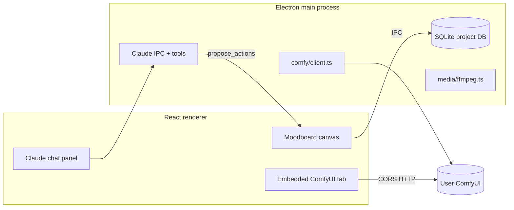

# Inline Studio Analysis

**Repo:** [inlineresearch/Inline-Studio](https://github.com/inlineresearch/Inline-Studio)  
**License:** MIT  
**Stack:** Electron + React + SQLite + embedded ComfyUI webview  
**Clone:** `.research/inline-studio/`

---

## What Inline Studio is

An **experimentation layer for visual artists** who already run ComfyUI. It is **not** a music-video-specific product. Its core metaphor:

```text
Workflow → Shot → Layer → Pipeline
```

A **Frame** is the atomic unit with immutable **Takes**. The **Moodboard** is a free-form node canvas (Figma/Miro-like) where frames, layers, previews, and text notes connect visually. ComfyUI renders linked workflows per frame.

**Closest local analogy:** moodboard + shot versioning — **not** the local studio's beat-driven auto-edit engine.

---

## Architecture



### Engine isolation rule (from CLAUDE.md)

All ComfyUI knowledge lives in `electron/main/comfy/`. The renderer embeds ComfyUI but does not duplicate graph logic. This is a **clean boundary** worth copying locally if ComfyUI is added behind a Next.js API route or sidecar.

---

## ComfyUI integration patterns

### Connection model

- User runs ComfyUI locally (`--enable-cors-header`) or on cloud GPU (RunPod docs).
- Inline Studio **does not bundle** ComfyUI.
- Default mental model: `http://127.0.0.1:8188`.

### What the bridge does today (Slice B)

From `electron/main/comfy/client.ts`:

| Operation | API | Purpose |
|-----------|-----|---------|
| Health | `/system_stats` | Reachability ping (6s timeout — tolerant of mid-render stalls) |
| Capabilities | `/object_info` | Full node catalog + model filenames (15s timeout) |
| Upload inputs | `/upload/image` | Push frame inputs before graph edit |
| Pull outputs | `/history`, `/view` | Capture latest render as Take |
| Workflow sync | Project-side JSON + Comfy userdata | Link workflow to frame |

**Notably absent vs ComfyStudio:** no `/prompt` queue orchestration layer in the README path — generation is **human-in-ComfyUI** with bridge pull-back.

### Capability grounding (high value pattern)

Before Claude authors workflow JSON, tools require:

- `get_comfy_capabilities` — node types + installed models from `/object_info`
- `lookup_comfy_nodes` — per-node input/output schema
- `recall_workflows` — project memory of past graphs

**Anti-pattern avoided:** inventing node types or checkpoint names that do not exist on the user's install.

---

## Claude assistant / prompt engineering

### System prompt design (`electron/main/claude/prompt.ts`)

Key properties:

1. **Stable system prompt** — no per-turn interpolation (Anthropic prompt caching).
2. **Volatile snapshot in user turn** — frames, layers, assets, Comfy reachability.
3. **Vocabulary enforcement** — Project → Sequence → Frame → Take.
4. **Propose-then-apply** — `propose_actions` tool queues changes; user clicks apply.
5. **Canvas spatial reasoning** — default sizes, layer-relative coordinates, anti-overlap rules.
6. **ComfyUI workflow section** — separate authoring contract; must call capability tools first.

### Claude actions (`src/shared/claudeActions.ts`)

`suggestWorkflow` can include:

- `guidance` — prose instructions
- `starterGraph` — litegraph JSON with grounded nodes

Applying switches to Generate tab and opens the frame workflow in embedded ComfyUI.

### Patterns to adopt locally

| Pattern | Adoption idea |
|---------|---------------|
| Capability snapshot before LLM graph write | Pre-flight ComfyUI `/object_info` cache in settings |
| Propose-then-apply batch | Story tab "suggested treatment" as reviewable patch, not auto-write |
| Separate workflow authoring instructions | Split "creative brief LLM" from "Comfy JSON LLM" prompts |
| Project snapshot each turn | Pass `musicVideoProject` JSON summary to any future assistant |

### Patterns to avoid copying blindly

- Free-form canvas as primary UX — conflicts with local music-section workflow.
- Frame/Take model without musical section spine — wrong abstraction for auto-edit.
- Anthropic-only assistant — local stack may prefer hosted/multi-provider later.

---

## Video Director node (recent feature)

README highlights:

- **Video Director node** — timeline-in-a-node combining frame outputs + audio layers + export.
- **Edit Video/Audio node** — trim with filmstrip/waveform handles.

This is **in-graph assembly**, not beat-synced auto-edit. Useful as a **reference for lightweight assembly UX**, not as replacement for local FFmpeg section preview.

---

## Project portability

`.inlinestudio` export bundles:

- Inputs (imported assets)
- Outputs (all takes)
- ComfyUI workflow copies

**Lesson:** generative pipelines need **portable project folders**, not just timeline JSON. ComfyStudio's `project.comfystudio` + assets folder is similar.

---

## UI/UX observations

| Element | Inline Studio | Local project |
|---------|---------------|---------------|
| Primary surface | Infinite canvas | Tabbed music studio |
| Generation UI | Embedded ComfyUI | None (Generate tab = coverage) |
| Versioning | Takes per frame | Section preview versions |
| Assistant | Claude in header | None |
| Collaboration | Export whole pipeline | Web-first (future-friendly) |

Inline optimizes **exploration**; local optimizes **musical correctness on existing footage**.

---

## Local vs hybrid vs cloud

| Mode | Inline Studio |
|------|---------------|
| Local GPU | Primary path — user ComfyUI |
| Cloud GPU | RunPod walkthrough, paste public URL |
| Hybrid | Canvas local, render remote — supported |
| Managed Comfy | Not offered |

Same "bring your own ComfyUI" stance as ComfyStudio; unlike local project's **hosted Essentia/FFmpeg** cloud helpers.

---

## Music-video relevance score: **Low–Medium**

Inline Studio does not analyze songs, split lyrics, or rank clips to beats. Relevance is **architectural**:

- ComfyUI capability grounding
- Claude tool design
- Frame/take immutability
- Pipeline export

For music-video-specific LLM chains, prioritize **VRGDG** and **ComfyStudio Director Mode** over Inline Studio.

---

## Actionable takeaways

### Adopt

1. **`/object_info` capability cache** before any automated workflow authoring.
2. **Propose-then-apply** for LLM-driven story or shot-list edits.
3. **Engine isolation** — single Comfy client module, renderer stays dumb.
4. **Portable project bundles** including workflow JSON + media paths.

### Adapt

1. Map "Frame" to **section shot slot** or **coverage gap**, not generic canvas node.
2. Use assistant for **edit-plan patches** and **prompt suggestions**, not canvas layout.

### Skip (for now)

1. Full moodboard canvas as primary navigation.
2. Embedded ComfyUI tab inside Next.js — high complexity; prefer API queue from server/sidecar unless desktop pivot.

---

## Key files to re-read during implementation

| Path | Why |
|------|-----|
| `electron/main/comfy/client.ts` | Ping, object_info, upload, history |
| `electron/main/claude/prompt.ts` | System prompt structure |
| `src/shared/claudeActions.ts` | Tool action vocabulary |
| `src/shared/types.ts` | Frame, Take, ComfyRun contracts |
| `README.md` | Product positioning |
