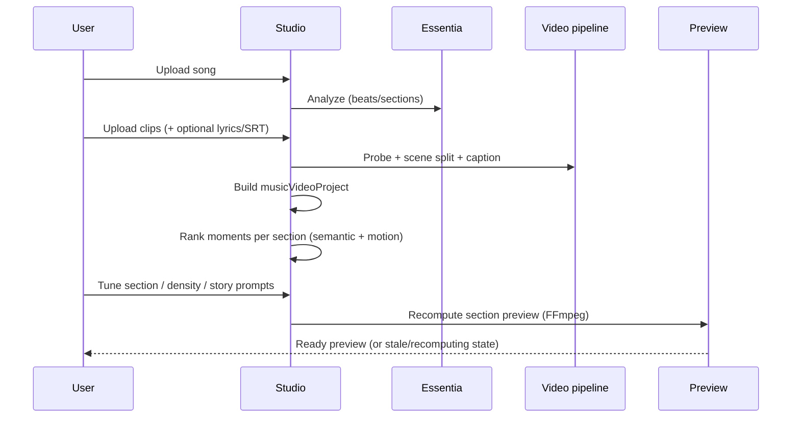

# Local Codebase Summary — `project-stack-structure`

**Role in comparison:** the active product repo — a **web-first smart auto music-video editor**, not a ComfyUI shell or full NLE.

---

## Product class (one sentence)

The user supplies a **song** and **video clips**; the app analyzes musical structure, logs visual moments, ranks segment placements with **musical alignment first** and **motion continuity second**, prepares **section previews**, and builds a **story/edit plan** — without requiring generative video as the default path.

---

## Non-negotiable rules (from roadmap / brief)

1. Musical alignment wins over visual heuristics.
2. Motion continuity is the default visual rejoin mode (not coarse direction tags).
3. Prepared preview with explicit stale/recomputing/ready states — no fake live mutation.
4. Segment-level analysis (post-cut segments), not whole-clip guessing.
5. Web-first until benchmark evidence justifies desktop/Tauri pivot.
6. Reference repos inform capabilities; this repo remains the product source of truth.

---

## Architecture overview

```mermaid
flowchart TB
    subgraph Browser["Next.js Studio (browser)"]
        StudioApp[StudioApp.tsx]
        Panels[Split / Beat / Story / Generate / Review tabs]
        Preview[Preview player + recompute states]
    end

    subgraph Contracts["TypeScript contracts"]
        Audio[audioAnalysis.ts]
        Manifest[segmentManifest.ts]
        Motion[motionDescriptors.ts + motionRanking.ts]
        Story[musicVideoProject.ts]
        Semantic[semanticEditPlanner.ts]
        Recompute[sectionRecompute.ts]
    end

    subgraph Proxies["Next.js API routes"]
        Essentia[/api/essentia/full]
        FFmpeg[/api/ffglitch + media gateway]
        Scene[/api/splitter/scene]
        Caption[/api/caption/scene]
        Export[/api/export/final]
    end

    subgraph Cloud["Hosted services"]
        EssentiaSvc[essentia.v1su4.dev]
        FFmpegGw[ffmpeg.v1su4.dev]
    end

    StudioApp --> Panels --> Contracts
    Contracts --> Proxies --> Cloud
    Preview --> FFmpegGw
```

### Execution model today

| Plane | Implementation | Notes |
|-------|----------------|-------|
| Audio analysis | Essentia via proxy or direct API | Beats, onsets, sections, energy — authoritative |
| Video ingest | Browser upload + ffprobe-style metadata | Thumbnails for browse, not playback clock |
| Scene detection | Hosted splitter route + PySceneDetect path | Scenes become `VideoMoment` candidates |
| Scene captioning | LFM / structured caption API | Feeds semantic matching |
| Segmentation | Beat/onset/section-driven cuts | `sourceTimeline`, `segmentManifest` |
| Ranking | `motionRanking` + `semanticEditPlanner` | Music-first policy encoded in tests |
| Preview | FFmpeg gateway section concat | Prepared assets, versioned recompute |
| Export | `exportGeneration.ts` + final route | Exists; not the first MVP proof |
| Generative video | **Not present** | Generate tab is coverage-oriented, not ComfyUI |

---

## Key modules (implementation anchors)

| Module | Responsibility |
|--------|----------------|
| `src/components/StudioApp.tsx` | Main studio shell, tab orchestration, upload flows |
| `src/components/studio/audioAnalysis.ts` | Essentia fetch, normalization, waveform |
| `src/components/studio/musicVideoProject.ts` | Canonical project: sections, lyric chunks, moments, edit plan |
| `src/components/studio/semanticEditPlanner.ts` | Lyric/story ↔ caption matching with motion continuity |
| `src/components/studio/motionDescriptors.ts` | Typed motion contract (residual motion, continuity) |
| `src/components/studio/motionRanking.ts` | Comparator enforcing music-first ordering |
| `src/components/studio/sectionRecompute.ts` | Stale/ready lifecycle for section previews |
| `src/components/studio/previewGeneration.ts` | Prepared preview via FFmpeg gateway |
| `src/components/studio/sceneCaptioning.ts` | Music-video-aware caption prompts |
| `src/components/studio/panels/StoryTab.tsx` | Story sections, transcript, treatment workflow |
| `src/components/studio/panels/GenerateTab.tsx` | Coverage slots / suggested prompts (non-ComfyUI) |
| `src/review/` | Review-room-inspired media review workspace |
| `src/lib/mediaGateway.ts` | Unified media operations toward FFmpeg gateway |

---

## Data contracts (what the AI stack consumes)

### Input package (from creative brief)

```text
audio/song.wav
lyrics/deepgram.json or lyrics.srt
clips/raw/*
analysis/audio_sections.json
analysis/beat_grid.json
analysis/lyric_chunks.json
analysis/clip_moments.json
brief/style.md
```

### Output package

```text
story/treatment.md
edit/edit_plan.json
edit/timeline.json
review/qa_report.md
renders/preview.mp4
```

### Core types (conceptual)

**`BeatJoinAnalysis`** — BPM, beats, downbeats, onsets, sections, energy curve, duration.

**`StorySection`** — musical section window + prompt + linked lyric chunks + assigned video moment IDs + optional `semanticMatch` score breakdown.

**`VideoMoment`** — post-scene or post-segment clip span with caption metadata, motion descriptor, keyframe URLs.

**`EditPlan`** — timeline items mapping sections to moments with music window alignment.

**`SemanticClipMatch`** — explicit scoring reasons (semantic, lyric-caption, action-intent, duration fit, motion continuity, repetition penalty).

---

## Prompt / planning behavior today

Local prompt engineering is **deterministic and ranking-based**, not multi-LLM generative:

- **Story section prompts** — user drafts + analysis-derived labels (intro/verse/chorus).
- **Scene captions** — LFM prompt with optional song/transcript context; describes visible truth first.
- **Semantic matching** — keyword/synonym scoring + motion continuity; no external LLM required for draft edit plan.
- **Generate tab** — builds suggested prompts from coverage slots and moment captions for **future** generation; not wired to ComfyUI.

This is fundamentally different from VRGDG's in-graph Gemma chains or ComfyStudio's Director Mode LLM shot-list writer.

---

## Music-video workflow (current user journey)



**Not in journey today:** keyframe generation, per-shot LTX render, lip-sync, timeline multi-track polish.

---

## UI/UX posture

- **Studio tabs** orient around music operations: Split, Beat Join, Story, Generate (coverage), Review.
- **Review workspace** borrows review-room patterns: media-forward, status pills, comment/analysis panels.
- **Explicit recompute UX** is a deliberate product choice (pressure-pass decision) — unlike ComfyStudio's generate-queue or VRGDG's fully automated graph run.
- **Not a Resolve-style NLE** — no multi-track ripple edit, transition library, or clip keyframing at ComfyStudio depth.

---

## External services map

| Service | URL | Used for |
|---------|-----|----------|
| Essentia API | `essentia.v1su4.dev` | Full audio analysis |
| FFmpeg Gateway | `ffmpeg.v1su4.dev` | Preview, concat, split, thumbnails, FFglitch |
| Deepgram (optional) | via API route | Transcription / lyric timing |

---

## Test and verification surface

```bash
bun run check
bun run test          # includes musicVideoProject, semanticEditPlanner, motionRanking
bun run preview:section
bun run probe:media
bun run bench:latency
```

Tests encode product law — e.g. motion continuity must not outrank musical alignment.

---

## Gaps relative to reference repos (honest)

| Capability | Local | Typical reference |
|------------|-------|-------------------|
| ComfyUI integration | None | All three refs |
| Multi-LLM prompt pipeline | None | VRGDG, partial Inline/ComfyStudio |
| Generative shot list | None | ComfyStudio Director Mode |
| Lip-sync / I2V shots | None | VRGDG HUMO/LTX, ComfyStudio LTX 2.3 |
| Full timeline NLE | Partial review + export | ComfyStudio |
| Pipeline canvas / takes | None | Inline Studio |
| Post FX nodes (grain, color match) | FFglitch path | VRGDG nodes |

---

## Strategic position

The local repo is strongest as the **musical edit brain + footage librarian** for existing clips. References fill **generation** and **finishing** layers. The comparative docs recommend bridging via optional ComfyUI lanes without collapsing the product into a ComfyUI clone.

See [where-we-are-stronger.md](./where-we-are-stronger.md) for the counterbalancing strengths.
