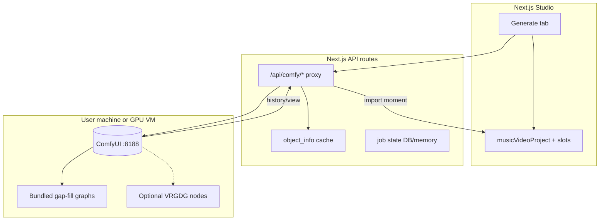
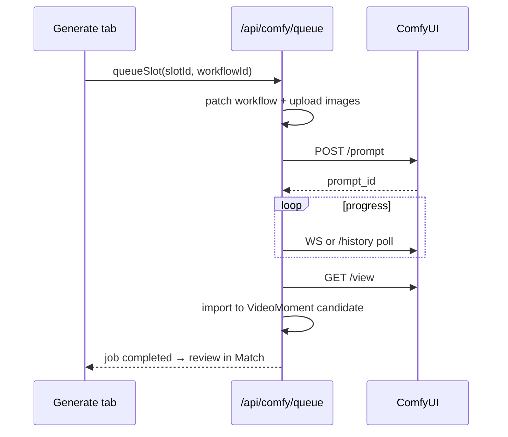

# Recommended Improvements — ComfyUI Backend

**Audience:** Integration design for optional generative lane  
**Scope:** ComfyUI patterns from Inline Studio, VRGDG, and ComfyStudio — **no application code**.

---

## Current state

| Fact | Implication |
|------|-------------|
| ComfyUI not in main app | No `/prompt`, no WS progress, no output import |
| Generate tab is UI shell | Coverage slots + suggested prompts only |
| FFmpeg + Essentia are hosted | ComfyUI should remain **user-local or dedicated sidecar**, not bundled in Next.js |
| Web-first product | Prefer API proxy to user's ComfyUI over embedding ComfyUI webview |

**Target architecture:** optional **Comfy sidecar lane** that fills coverage gaps without becoming the product shell.

---

## Reference architecture (target)



---

## Recommendation 1 — Engine isolation module

**Source:** Inline Studio `electron/main/comfy/` rule

**What to do:** Single server-side module (e.g. `src/lib/comfy/` or `src/server/comfy/`) owning:

- Connection config (host, port, CORS assumptions)
- Health ping (`/system_stats`, 6s timeout — Inline tolerant of mid-render)
- `/object_info` fetch + cache (15s timeout)
- `/upload/image` for reference frames
- `/prompt` queue + `client_id`
- WebSocket or polling for progress
- `/history` + `/view` output retrieval

Renderer/components call **typed functions only** — no scattered fetch URLs.

**Action items:**

1. Document module boundary in `docs/architecture/comfyui-integration.md`.
2. Env vars: `COMFYUI_BASE_URL` (default `http://127.0.0.1:8188`).
3. Proxy only from server routes — never expose user's ComfyUI directly to browser without auth consideration.

---

## Recommendation 2 — Capability pre-flight

**Source:** Inline `get_comfy_capabilities`; ComfyStudio setup checks

Before first queue job per session:

```text
1. GET /system_stats → reachable
2. GET /object_info → cache node catalog + models
3. Check required class_types for selected workflow template
4. Surface missing nodes/models in Generate tab (blocking or warning)
```

**Required nodes for v1 gap-fill lane (suggested minimum):**

| Workflow | Required classes |
|----------|------------------|
| Image extend / keyframe | `LoadImage`, `SaveImage`, image model loader |
| I2V gap clip | `LoadImage`, LTX/WAN loader, `SaveVideo` or equivalent |
| Optional lip-sync | LTX ID-LoRA path (ComfyStudio `ltx23-id-lora`) |

**Action items:**

1. `comfyCapabilities.ts` — parse object_info into `{ nodes, checkpoints, vae, loras }`.
2. `checkWorkflowRequirements(workflowJson, capabilities)` — returns `{ ok, missing[] }`.
3. TTL cache 15 minutes; invalidate on user "Refresh capabilities" click.

---

## Recommendation 3 — Workflow registry (ComfyStudio pattern)

**Source:** `workflowRegistry.js`, bundled `public/workflows/`

**What to do:** Ship **small curated API JSON templates** for gap-fill, not full VRGDG graphs:

| Workflow ID | Purpose | Based on |
|-------------|---------|----------|
| `gap-keyframe-zimage` | Still for empty slot | CS `z-image-turbo` |
| `gap-i2v-ltx23` | Motion clip from keyframe | CS `ltx23-i2v` |
| `gap-i2v-ltx23-audio` | Lip-sync performance gap | CS `music_video_shot_ltx2_3_i2v_audio` |
| `gap-bridge-flf` | A→B bridge | Seedance FLF or local equivalent |

Store in `public/workflows/comfy/` or repo `workflows/comfy/` with manifest:

```json
{
  "id": "gap-i2v-ltx23-audio",
  "label": "Gap fill: LTX 2.3 + audio",
  "requiredNodes": ["..."],
  "endpointTitles": ["LOCAL_PROMPT", "LOCAL_INPUT_IMAGE"]
}
```

**Action items:**

1. Version workflow JSON files; checksum in manifest.
2. Map coverage slot `GenerationNeed` → workflow ID (`b-roll`, `extend-start`, `bridge`, etc.).
3. Document VRAM expectations per workflow in manifest (CS README pattern).

---

## Recommendation 4 — Endpoint injection (adapt ComfyStudio titles)

**Source:** `CUSTOM_VIDEO_ENDPOINTS` in `comfyui.js`

ComfyStudio uses `_meta.title` matching `COMFYSTUDIO_*`. Local should define **`LOCAL_*` or `STACK_*`** equivalents to avoid collision:

```text
STACK_INPUT_IMAGE
STACK_PROMPT
STACK_SEED
STACK_WIDTH / STACK_HEIGHT
STACK_FPS / STACK_DURATION
STACK_AUDIO
STACK_OUTPUT_VIDEO
```

Injection before queue:

1. Load workflow template JSON
2. `findEndpointNodes(workflow, ENDPOINT_CONFIG)`
3. `setEndpointValue(node, slot.prompt | slot.seed | ...)` 
4. Upload reference frames → set `STACK_INPUT_IMAGE`
5. POST `/prompt`

**Action items:**

1. Publish starter graph with endpoint nodes as Primitive/String nodes (ComfyStudio uses `PrimitiveInt` for dimensions).
2. `patchWorkflowForSlot(workflow, slot, capabilities)` — single function.
3. Optional: compat mode that recognizes `COMFYSTUDIO_*` titles for users importing CS graphs.

---

## Recommendation 5 — Job queue and progress

**Source:** ComfyStudio Generate workspace; Inline history pull

**Job model:**

```typescript
// conceptual
ComfyJob {
  id: string
  slotId: string
  workflowId: string
  promptId: string        // from ComfyUI
  status: queued | running | completed | failed
  progress?: number
  outputs?: { videoUrl?, imageUrl? }
  error?: string
  createdAt, updatedAt
}
```

**Flow:**



**Action items:**

1. Persist jobs in SQLite/Postgres or ephemeral memory for MVP with client polling.
2. Expose `GET /api/comfy/jobs?projectId=`.
3. On complete: create **`VideoMoment`** with `source=generated`, link to slot, mark Match tab stale.
4. Sound/notification optional (CS generation completion sound pattern).

---

## Recommendation 6 — Output import as first-class moments

**Source:** ComfyStudio `comfyAutoImport.js`

Generated outputs must enter the **same ranking pipeline** as uploaded clips:

1. Download video/image from ComfyUI `/view`
2. Store in project media storage (or user-linked path for desktop future)
3. Run scene split + caption on generated clip (local strength)
4. Add to `videoMoments` with metadata: `{ generative: true, slotId, workflowId, prompt }`
5. User approves in Match before Join

**Never** auto-insert into `editPlan.timelineItems` without approval.

---

## Recommendation 7 — ComfyUI connection UX

**Source:** ComfyStudio Settings + launcher; Inline CORS docs

| Mode | UX |
|------|-----|
| Local default | `http://127.0.0.1:8188` |
| Remote GPU | User pastes URL (RunPod) — Inline pattern |
| Unreachable | Generate tab locked with setup instructions |

Settings fields:

- ComfyUI base URL
- Test connection button
- Capability refresh
- Optional: path to ComfyUI install (for future desktop helper only)

**Do not** auto-launch ComfyUI from web app v1 — ComfyStudio Electron can; web cannot reliably.

---

## Recommendation 8 — Bridge round-trip (optional, Phase C)

**Source:** ComfyStudio Bridge `Send to ComfyStudio`

Lower priority for web product. If pursued:

1. Inject lightweight JS extension when user opens ComfyUI in new tab (bookmarklet or ComfyUI custom node pack).
2. Export API JSON back to local app via paste or local webhook.

For MVP, **manual JSON import** of workflow templates is sufficient.

---

## Recommendation 9 — VRGDG as optional user install

**License:** AGPL-3.0 — do not bundle VRGDG in hosted product.

**Supported pattern:**

- User installs VRGDG in their ComfyUI
- Local app triggers **API JSON** from `UsedForUIDoNotTouch/*_ForUI_API.json` equivalents (reimplemented MIT templates)
- Or user runs VRGDG Video Builder externally; imports outputs as files

**Do not:**

- Copy VRGDG Python into Next.js server
- Ship VRGDG nodes as part of SaaS runtime

---

## Recommendation 10 — Security and ops

| Concern | Mitigation |
|---------|------------|
| SSRF via Comfy URL | Allowlist localhost + user-configured host; block metadata IPs |
| Open ComfyUI on LAN | Warn user; optional API key header if Comfy adds auth |
| Large uploads | Stream to ComfyUI; size limits per plan |
| Job spam | Rate limit queue per user/session |
| Secrets in workflows | Strip API keys from imported JSON; use env injection |

---

## Phased implementation

| Phase | Backend deliverable |
|-------|---------------------|
| **B0** | Health + object_info proxy + capability cache |
| **B1** | Single workflow queue (keyframe still) + output download |
| **B2** | I2V gap clip + job list + moment import |
| **B3** | Audio-conditioned performance shot + endpoint compat |
| **B4** | WebSocket progress + retry + batch queue for N slots |

---

## Testing checklist

```bash
# After implementation (conceptual)
bun run test -- comfyCapabilities
bun run test -- workflowPatch
bun run test -- comfyJobLifecycle
```

Integration tests with **mock ComfyUI** HTTP server returning fixed object_info/history.

Manual QA:

1. ComfyUI offline → clear error, Generate locked
2. Missing LTX node → pre-flight warning
3. Completed job → new moment appears in Match
4. Reject moment → slot returns to missing state

---

## Related documents

- [recommended-improvements-prompt-engineering.md](./recommended-improvements-prompt-engineering.md) — prompts fed into patched workflows
- [recommended-workflow-changes.md](./recommended-workflow-changes.md) — end-user journey
- [inline-studio-analysis.md](./inline-studio-analysis.md) — client.ts reference
- [comfystudio-analysis.md](./comfystudio-analysis.md) — comfyui.js + registry
