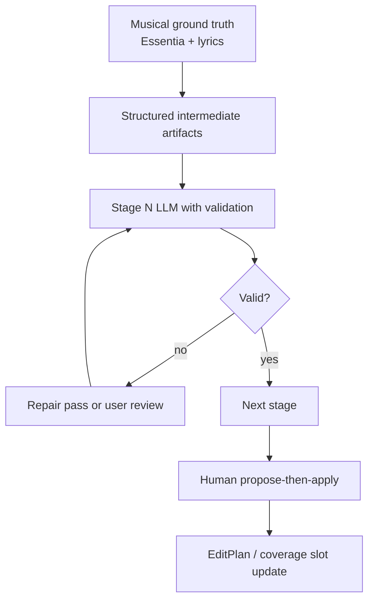
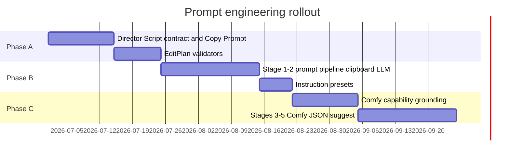

# Recommended Improvements — Prompt Engineering

**Audience:** Product + implementation planning for `project-stack-structure`  
**Scope:** Actionable LLM/prompt patterns borrowed from Inline Studio, VRGDG, and ComfyStudio — **no application code in this doc**.

---

## Current local baseline

Local prompt behavior today is **deterministic-first**:

- Story section prompts — user + analysis labels
- Scene captions — LFM with song/transcript context
- Semantic matching — keyword/synonym + motion continuity (`semanticEditPlanner.ts`)
- Generate tab — suggested prompts from coverage slots; **not wired to any LLM or ComfyUI**

The gap is not "better adjectives" — it is **structured multi-stage planning for generative gap-fill** while preserving musical authority from Essentia.

---

## Design principles (synthesized from references)



1. **Musical ground truth stays local** — beats, sections, lyric chunks from Essentia/Deepgram; never let LLM invent BPM or section boundaries.
2. **Separate creative LLM from execution LLM** — Inline Studio splits chat assistant from Comfy JSON authoring; apply same split for treatment vs T2V prompts.
3. **Intermediate artifacts are files/JSON** — VRGDG writes `lyricsegements`, `t2i_Prompts`, SRT to disk; local should write equivalent under project analysis folder.
4. **Validate between stages** — VRGDG JSON repair; ComfyStudio coverage/overlap/drift checks.
5. **Propose-then-apply** — Inline pattern; never auto-mutate `musicVideoProject` from LLM output.

---

## Recommendation 1 — Adopt ComfyStudio Director Script format (adapted)

**Source:** ComfyStudio `parseStructuredDirectorScript`, `buildMusicVideoLLMPrompt`

**What to do:** Define a **local Director Script variant** for gap-fill shots only (not whole MV replacement):

```text
Section: chorus-2
Start at: 1:04.500
Duration: 3.2s
Shot type: b_roll | performance | bridge
Lyric moment: "we don't look back"
Keyframe intent: neon alley, rain, wide
Motion intent: slow push-in, subject walking away
Coverage slot id: slot-abc123
Reference frames: moment-42-first, moment-42-last
```

**Why:** ComfyStudio proved clipboard LLM handoff with strict format reduces parse failures. Local can reuse field names for familiarity.

**Action items:**

1. Add `docs/contracts/director-script-music-video.md` specifying fields + examples.
2. Add Story tab or Generate tab **"Copy LLM Prompt"** builder that injects:
   - Essentia section window (start/end, energy, label)
   - Lyric chunks for that window
   - Coverage slot metadata (missing duration, weak match score, reference frame URLs)
   - Shot type enum aligned with ComfyStudio taxonomy (performance / b_roll / bridge)
3. Parser returns `GenerativeShotProposal[]` — reviewable before merge into project.

---

## Recommendation 2 — VRGDG-style multi-stage pipeline (server-side)

**Source:** `VRGDG_MusicVideoPromptCreatorNodes.py` stages

**Proposed local stages** (only when user triggers "Generate prompts for gaps"):

| Stage | Input | Output | Validation |
|-------|-------|--------|------------|
| 1. Segment map | Lyric chunks + section windows | `segment_map.json` | Count matches coverage slots |
| 2. Concept | Section prompts + style brief | `concepts.json` per slot | Non-empty, max length |
| 3. Keyframe prompts | Concepts + reference captions | `t2i_prompts.json` | Subject prefix consistency |
| 4. Motion prompts | Keyframe + lyric + shot type | `i2v_prompts.json` | Duration hint present |
| 5. Repair | Any stage output | Fixed JSON | Schema + count check |

**Do not copy VRGDG Python** — reimplement as Next.js API routes or Python sidecar with clean MIT/ proprietary license.

**Action items:**

1. Define JSON schemas in `docs/contracts/generative-prompt-artifacts.md`.
2. Store artifacts under `analysis/generative/` in project export layout (mirrors creative brief packages).
3. Each stage exposes `POST /api/generative/prompt-stage/{name}` with `{ projectId, slotIds[], dryRun? }`.
4. UI shows stage progress + diff before apply (Inline propose-then-apply).

---

## Recommendation 3 — Instruction presets per stage

**Source:** VRGDG `_prompt_creator_instruction`, preset save/load

**What to do:** User-editable instruction templates:

| Preset key | Default purpose |
|------------|-----------------|
| `repair_segments` | Fix LLM JSON for lyric segments |
| `create_concepts` | Visual concept from story + lyrics |
| `t2i_keyframe` | Still image prompt for music video |
| `i2v_motion` | Motion/lip-sync aware video prompt |
| `bridge_shot` | A→B transition description |

Store in project settings or user profile; version with project export.

**Action items:**

1. Settings panel: "Prompt pipeline instructions" with reset-to-default.
2. Include presets in LLM system prompt for each stage (VRGDG pattern).
3. Log which preset version produced each artifact (audit trail).

---

## Recommendation 4 — Inline capability grounding before Comfy JSON

**Source:** Inline `get_comfy_capabilities`, `lookup_comfy_nodes`

**What to do:** Before any LLM writes ComfyUI workflow JSON for a coverage slot:

1. Fetch and cache `/object_info` from user's ComfyUI (TTL 15 min).
2. Pass **allowed node types + installed checkpoints** into prompt context.
3. Reject or flag graphs referencing unknown nodes at validation time.

**Action items:**

1. Document required ComfyUI capabilities for "gap-fill lane v1" (e.g. LTX 2.3 i2v + LoadImage).
2. Add pre-flight check in Generate tab: Comfy reachable? Required nodes present?
3. Separate system prompt section: "Workflow authoring" vs "Creative prompting" (Inline `prompt.ts` pattern).

---

## Recommendation 5 — ComfyStudio plan validators on local EditPlan

**Source:** ComfyStudio `buildMusicVideoPlanFromScript` warnings

Apply analogous checks to **`EditPlan` + coverage slots** without LLM:

| Validator | Local implementation idea |
|-----------|---------------------------|
| Coverage | Sum of timeline items vs song duration; list gaps > 0.5s |
| Section overlap | No two items same section with overlapping music windows |
| Lyric drift | If slot has `lyricMoment` + `startAt`, compare to chunk timestamp |
| Weak match threshold | Flag slots with semantic score below configurable floor |
| Motion continuity break | Flag hard cuts where continuity score < threshold across adjacent slots |

Surface as Generate tab banner (amber/red), same UX language as ComfyStudio warnings.

**Action items:**

1. Extend `semanticEditPlanner` findings with `kind` enum matching CS (`coverage-summary`, `shot-overlap`, etc.).
2. Unit tests for each validator with fixture projects.

---

## Recommendation 6 — Scene caption prompt upgrades

**Source:** VRGDG lyric-aware notes; ComfyStudio shot type suffixes

**Current:** LFM describes visible truth first.

**Upgrade when song context present:**

```text
System: You caption footage for music-video editing. Describe visible truth first.
User: Section=chorus, energy=high, lyrics="...", shot_need=b_roll|performance
```

Add **action intent** field aligned with `semanticEditPlanner` INTENT_SYNONYMS — improves match without extra LLM call.

**Action items:**

1. Pass `StorySection.label`, `energy`, `lyricTexts` into caption API (may already partial — verify parity).
2. Request structured caption output: `{ caption, subjects[], action, setting, shotType }` JSON.
3. Map `shotType` to ComfyStudio taxonomy for downstream generative prompts.

---

## Recommendation 7 — Propose-then-apply for Story tab

**Source:** Inline `propose_actions` + `applyClaudeActions.ts`

**Flow:**

1. User asks assistant (future) or clicks "Suggest treatment patch".
2. LLM returns JSON patch: `{ addSectionPrompts[], reassignMoments[], newLyricLinks[] }`.
3. UI shows diff preview; user clicks Apply.
4. Triggers section recompute stale state — never silent preview swap.

**Action items:**

1. Define patch schema compatible with `musicVideoProject.ts` types.
2. Reject patches that modify Essentia-derived timings (read-only fields).
3. Log applied patches for undo (single-level undo sufficient for MVP).

---

## Recommendation 8 — External LLM provider strategy

| Provider | Use case | Reference |
|----------|----------|-----------|
| User clipboard | Director Script generation | ComfyStudio |
| Hosted API (Gemini/GPT) | Concept + prompt stages | VRGDG Google path |
| Local (LM Studio) | Privacy-sensitive users | VRGDG Gemma Runner |
| Deterministic only | Semantic match, validators | Local today |

**Action items:**

1. Environment-configured provider per stage; default **clipboard** for v1 (zero infra).
2. Never send raw user media to LLM without explicit consent toggle.
3. Stable system prompts with caching-friendly structure (Inline: no per-turn system interpolation).

---

## Phased rollout



| Phase | Deliverable | User-visible outcome |
|-------|-------------|---------------------|
| **A** | Director format + validators | Better gap visibility; copy-paste LLM workflow |
| **B** | Concept + keyframe stages | Prompt files per coverage slot |
| **C** | Comfy-aware workflow suggest | Generate tab queues real jobs (with backend doc) |

---

## Anti-patterns to avoid

1. **LLM-owned musical timing** — ComfyStudio moved to SRT-authoritative `Start at:` for a reason; Essentia beats are more authoritative for cut placement.
2. **Single mega-prompt** — VRGDG multi-stage exists because repair is cheaper than rerun entire graph.
3. **Auto-apply LLM to timeline** — breaks prepared preview contract.
4. **Embedding VRGDG AGPL prompt code** — reimplement patterns only.
5. **Generating whole MV by default** — contradicts product class; gap-fill only until user opts in.

---

## Success metrics

| Metric | Target |
|--------|--------|
| Parse success rate for Director Script paste | > 90% without manual fix |
| Coverage validator catches gaps before Generate | 100% of gaps > 1s flagged |
| Prompt stage repair rate | < 20% need second LLM pass |
| User apply rate for proposed patches | Track; > 50% indicates useful suggestions |
| Semantic match score lift on generated slots | Measurable vs weak-match baseline |

---

## Related documents

- [vrgamedevgirl-comfyui-analysis.md](./vrgamedevgirl-comfyui-analysis.md) — Prompt Creator stages
- [comfystudio-analysis.md](./comfystudio-analysis.md) — Director Mode + validators
- [inline-studio-analysis.md](./inline-studio-analysis.md) — Claude tooling + grounding
- [recommended-improvements-comfyui-backend.md](./recommended-improvements-comfyui-backend.md) — execution layer
