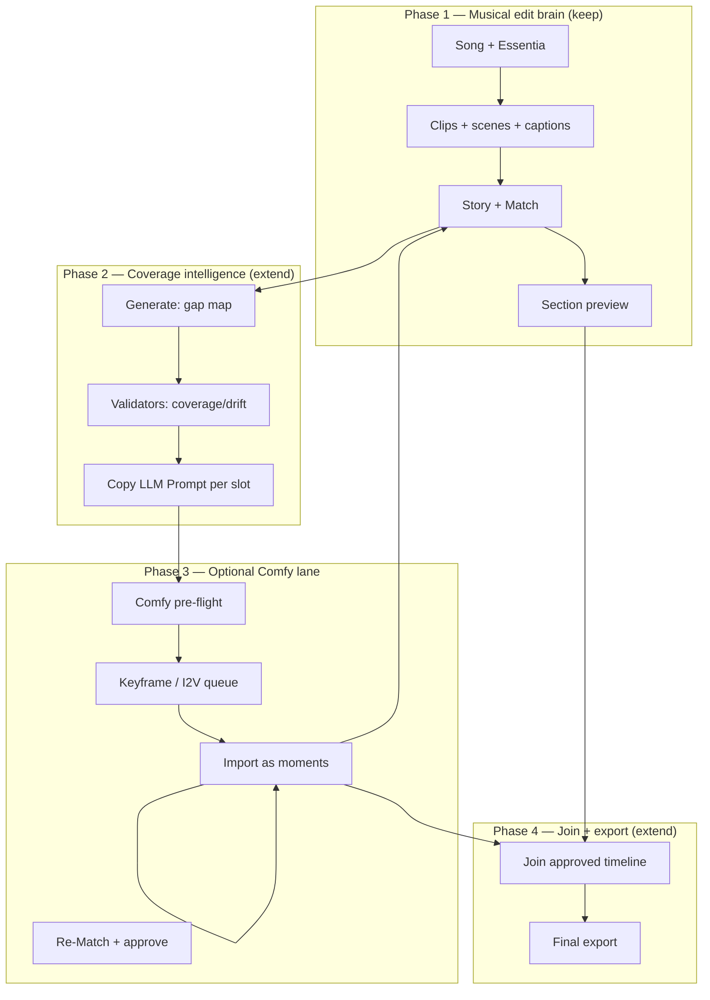
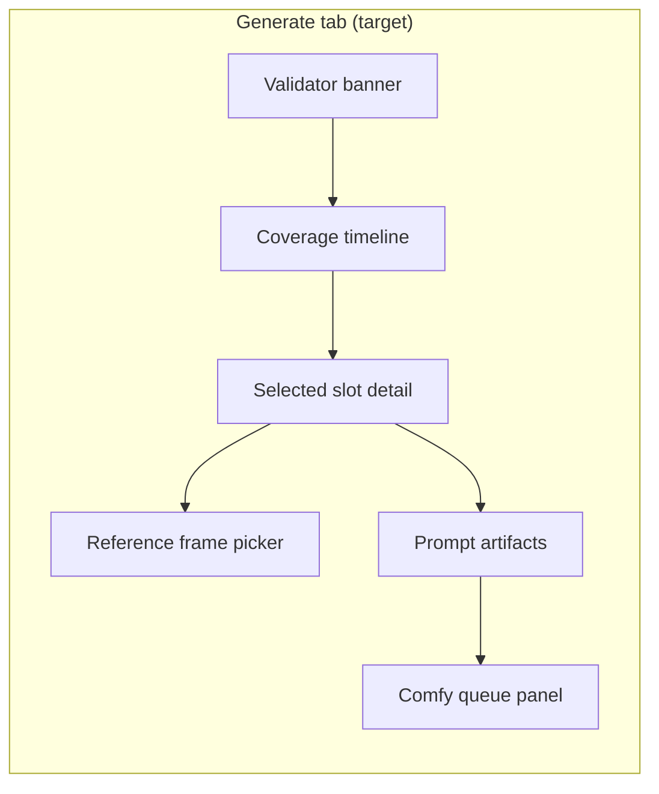

# Recommended Workflow Changes

**Audience:** Product planning — end-to-end music-video workflow evolution  
**Scope:** How the local user journey should change, informed by all four codebases. **No application code.**

---

## Current workflow (baseline)

```mermaid
flowchart LR
    A[Upload song] --> B[Essentia analysis]
    C[Upload clips] --> D[Scene split + caption]
    B --> E[Story sections]
    D --> F[Video moments]
    E --> G[Semantic match]
    F --> G
    G --> H[Section preview FFmpeg]
    H --> I[Export optional]
    
    style I fill:#333,stroke:#666
    style Gen fill:#333,stroke:#666
    Gen[Generate tab<br/>shell only] -.-> G
```



**Pain points today:**

1. Generate tab identifies gaps but cannot fill them.
2. No generative shot list for uncovered sections.
3. Export exists but product proof is **musically correct rough cut from existing footage**.
4. ComfyUI entirely outside the product boundary.

---

## Target workflow (hybrid music-first)

**Principle:** Keep local product class — **auto editor for user-supplied clips** — add **optional generative lane** for gaps only.



---

## Tab journey changes

### Split / Beat Join — minimal change

| Keep | Add |
|------|-----|
| Essentia authority | Display lyric chunk boundaries on waveform (if not already) |
| Section labels from analysis | Link sections to future coverage slots early |

No ComfyUI involvement.

---

### Story — moderate enhancement

| Current | Recommended |
|---------|-------------|
| User drafts section prompts | + **Treatment template** with cast/concept/style (ComfyStudio Director setup lite) |
| Transcript / lyric chunks | + Single lyrics field with **SRT/LRC auto-detect** (CS Option A merge) |
| Manual assignment | + **Findings banner** for uncovered sections (validator) |

**New user actions:**

1. Paste timed lyrics once; badge shows SRT vs plain.
2. Optional: "Copy LLM Prompt" for full treatment (not per-shot yet) — narrative pass only.
3. Review warnings: "Chorus 2 has no assigned moments — 4.2s gap."

---

### Match — small enhancement

| Current | Recommended |
|---------|-------------|
| Semantic + motion ranking | + Show **coverage slot ID** on each assignment |
| Manual overrides | + Flag **weak match** threshold visually (already partially in Generate) |
| — | + Button: "Send to Generate" for selected weak/missing slots |

Match remains the **approval gate** for all footage (imported or generated).

---

### Generate — major evolution (still not full ComfyUI shell)

Transform from read-only coverage shell to **gap-fill command center**:



| Area | v0 today | v1 target | v2 target |
|------|----------|-----------|-----------|
| Coverage map | ✅ | ✅ + export CSV | + beat-aligned zoom |
| Slot types | ✅ b-roll, extend, bridge | + performance/lip-sync type | + batch select |
| Suggested prompts | Static from captions | LLM stage artifacts | Editable presets |
| Comfy connection | ❌ | Settings + pre-flight | Queue + progress |
| Queue | ❌ | Single slot keyframe | Batch I2V |
| Output | ❌ | Import as moment | Auto re-caption |

**Critical rule (from roadmap):** Generate does **not** invent fallback shots silently — missing stays visible until Comfy job completes and user approves in Match.

---

### Join — moderate enhancement

| Current | Recommended |
|---------|-------------|
| Assemble approved items | + Distinguish IMP vs GEN badges on timeline items |
| FFmpeg section concat | + Optional post-FX pass (grain/color — VRGDG-inspired via FFmpeg gateway) |
| — | + Pre-export validator: all slots filled or explicitly waived |

---

### Review — align with review-room patterns

Optional parallel path for client review of section previews before Join — already partially present in `src/review/`. No ComfyUI change.

---

## New cross-cutting workflows

### Workflow A — "Gap fill one slot"

**Trigger:** User selects purple/red slot in Generate.

1. Show reference frames (first/last from nearest matched moment).
2. User clicks "Generate prompts" → stages 1–4 (prompt engineering doc) OR paste Director Script.
3. User reviews/edits prompts.
4. User clicks "Queue keyframe" → Comfy still.
5. User clicks "Queue clip" → Comfy I2V (optional audio for performance type).
6. On complete: new moment in Match tab with GEN badge.
7. User approves → slot turns green → section preview goes stale → recompute.

**Time expectation:** minutes per slot (GPU dependent), not one-click full MV.

---

### Workflow B — "Batch gap fill section"

**Trigger:** Entire chorus under-covered.

1. Multi-select slots in Generate timeline.
2. "Copy LLM Prompt" includes all slots in one Director Script briefing.
3. User pastes multi-shot script back → parser creates proposals per slot.
4. Batch queue with concurrency limit (ComfyStudio-style queue discipline).
5. Match tab shows batch review grid.

**Reference:** VRGDG batch buttons; ComfyStudio YOLO plan — but **scoped to gaps**, not whole song generation.

---

### Workflow C — "External generative round-trip"

For users who prefer VRGDG Video Builder or ComfyStudio:

1. Export gap manifest: `analysis/coverage_gaps.json` + reference frames + lyric chunks + Essentia section windows.
2. User generates externally.
3. Import returned clips → normal scene split + caption + Match.

No Comfy integration required in app — preserves web-first posture.

---

## Data contract additions

Extend creative brief packages (from `local-codebase-summary.md`):

```text
analysis/coverage_slots.json      # slot id, section, window, status, needs[]
analysis/generative/
  segment_map.json
  concepts.json
  t2i_prompts.json
  i2v_prompts.json
analysis/comfy_jobs.json          # job id, slot id, status, outputs
edit/generative_moments.json      # approved generated moment links
```

Timeline items gain optional fields:

```json
{
  "momentId": "...",
  "source": "imported | generated",
  "coverageSlotId": "...",
  "comfyJobId": "..."
}
```

---

## What NOT to change

| Do not | Why |
|--------|-----|
| Replace Essentia with audio-split scene count | Musical alignment is differentiator |
| Default to full AI MV generation | Collapses into ComfyStudio/VRGDG product class |
| Auto-apply LLM edits | Breaks prepared preview contract |
| Build Resolve-style NLE now | Roadmap explicitly defers |
| Embed ComfyUI webview in v1 | Inline/CS complexity; sidecar queue sufficient |
| Bundle VRGDG AGPL code | License risk |

---

## Milestone mapping (suggested)

| Milestone | Workflow outcome | References used |
|-----------|------------------|-----------------|
| **M1** | Validators + Copy LLM Prompt on gaps | ComfyStudio Phase 8 |
| **M2** | Prompt stage artifacts (clipboard LLM) | VRGDG Prompt Creator |
| **M3** | Comfy pre-flight + one keyframe workflow | Inline grounding + CS registry |
| **M4** | I2V gap clip + moment import + re-Match | CS auto-import |
| **M5** | Batch queue + performance audio shot | CS music_video_shot + VRGDG HUMO patterns |
| **M6** | Export with GEN/IMP mix + optional post-FX | VRGDG grain/color via FFmpeg |

Align with existing roadmap phases — insert M1–M2 into current "Story/Match hardening"; M3+ as explicit **optional generative epic** after section preview benchmark passes.

---

## User-facing narrative (one paragraph)

> Upload your song and clips. The studio analyzes the music, finds the best moments in your footage, and builds a beat-aware rough cut. Where footage runs out, the Generate tab shows exactly what's missing — and helps you fill gaps with AI shots you approve, without handing the whole edit to a black-box generator. ComfyUI stays on your machine; the product stays focused on musical correctness.

---

## Success criteria

| Criterion | Measure |
|-----------|---------|
| Musical correctness preserved | Existing motionRanking tests still pass; no LLM overrides beats |
| Gap visibility | 100% of timeline required duration accounted in coverage map |
| Generative optional | Users can complete MV without ComfyUI (import-only path) |
| Approval gate | Zero auto-insert generated clips into Join |
| Time-to-first-preview | No regression vs current section preview path |

---

## Related documents

- [cross-repo-comparison.md](./cross-repo-comparison.md)
- [recommended-improvements-prompt-engineering.md](./recommended-improvements-prompt-engineering.md)
- [recommended-improvements-comfyui-backend.md](./recommended-improvements-comfyui-backend.md)
- [where-we-are-stronger.md](./where-we-are-stronger.md)
- [../../docs/roadmap.md](../../docs/roadmap.md)
