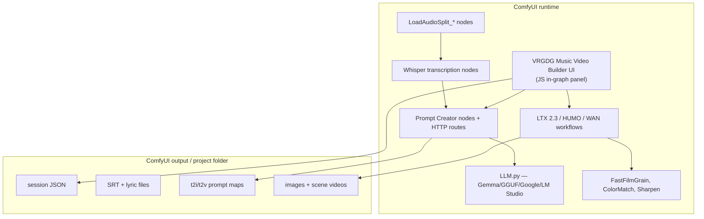
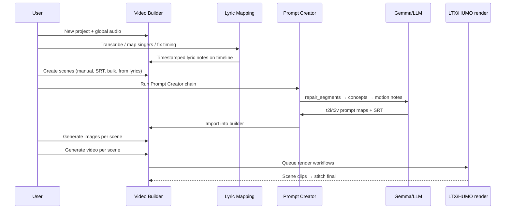

# VRGameDevGirl ComfyUI Analysis

**Repo:** [vrgamegirl19/comfyui-vrgamedevgirl](https://github.com/vrgamegirl19/comfyui-vrgamedevgirl)  
**License:** **AGPL-3.0** (README also mentions MIT in places — treat AGPL as binding for hosted/commercial use)  
**Stack:** ComfyUI custom nodes (Python) + in-graph JavaScript UI extensions  
**Research branch:** `dev/music-video-builder-ui-test-v9` (user alias `test_v9`)  
**Clone:** `.research/comfyui-vrgamedevgirl/`

---

## What VRGDG is

A **ComfyUI-native music video factory**: custom nodes, multi-stage LLM prompt chains, audio splitting, lyric transcription/repair, scene-by-scene builder UI, and LTX/HUMO/WAN render workflows — all inside the graph.

Unlike the local product, VRGDG assumes **generation is the default path**. The user brings audio (+ optional reference image) and the graph produces scenes, prompts, keyframes, and stitched video.

**Closest local analogy:** what the Generate tab *could* become if wired to ComfyUI — but VRGDG owns the entire lyric→prompt→render loop in-graph, not a coverage shell over existing footage.

---

## Architecture



### Submodule layout (`__init__.py`)

The pack loads ~20 Python modules dynamically. Key ones for music-video research:

| Module | Role |
|--------|------|
| `LLM.py` | Unified text LLM runner (Gemma GGUF, HuggingFace, Google REST, LM Studio) |
| `VRGDG_MusicVideoPromptCreatorNodes.py` | Prompt Creator HTTP API + multi-stage lyric/prompt pipeline |
| `VRGDG_MusicVideoBuilderNodes.py` | Video Builder UI node + project persistence |
| `VRGDG_StoryboardBuilderNodes.py` | Storyboard-oriented helpers |
| `GeneralVideoNodes.py` / `GeneralVideoNodes2.py` | Audio split, combine, utility video ops |
| `HumoAutomation*.py` | HUMO lip-sync automation, Whisper lyric extraction |
| `VRGDG_VideoEditorNodes.py` | In-graph video editing helpers |
| `VRGDG_GeneralNodes.py` | Segment/prompt parsing utilities |
| `web/*.js` | Dynamic UI for builder, prompt creator, audio split widgets |

On startup, VRGDG creates placeholder text-file templates under `ComfyUI/output/VRGDG_TEMP/TextFiles/` for lyric segments, story concepts, T2I/T2V prompts, etc.

---

## Video Builder UI (v9 branch)

The v9 clone matches branch `dev/music-video-builder-ui-test-v9` (commit `1676f53`). Public docs reference v8 imagery; v9 extends the same builder pattern with updated LLM model lists.

### Entry point

Add node **`VRGDG Music Video Builder UI`** in ComfyUI. Opens a full-screen in-graph application with:

| Area | Purpose |
|------|---------|
| Top bar | Project menu, save, Reference Builder, Lyric Mapping, Gemma Runner, Builder Agent, Prompt Options, batch runs |
| Left panel | Scene list |
| Center | Selected image/video preview |
| Right panel | Scene / Image / Video / Audio tabs |
| Bottom timeline | Waveform, scene blocks, lyric notes, beat snap, inserts |

### Project model

Projects persist under ComfyUI output folders:

```text
{project}/
├── session JSON (builder state)
├── global audio + per-scene audio copies
├── SRT / lyric mapping files
├── reference images (character/location)
├── t2i + t2v prompt files
├── generated scene images
├── rendered scene videos
└── stitched final export
```

This is a **folder-based portable project**, similar in spirit to ComfyStudio's `project.comfystudio` + assets — but entirely ComfyUI-local.

### Scene lifecycle



---

## Prompt Creator pipeline

The Prompt Creator is VRGDG's **core prompt-engineering engine**. Implementation lives in `VRGDG_MusicVideoPromptCreatorNodes.py` with REST routes under `/vrgdg/music_prompt_creator/*`.

### Multi-stage LLM chain

| Stage | Function | Output |
|-------|----------|--------|
| Whisper ingest | Audio → timed segments | Raw lyric segment map |
| `repair_segments` | Fix malformed JSON / align segment count | Canonical segment mapping |
| `create_concepts` | Story + visual concepts per segment | Concept text per scene |
| `extract_subject` | Character/subject consistency | Subject string for prompt prefix |
| `create_i2v_motion_notes` | Motion/performance direction | Video prompt supplements |
| Save outputs | Write project files | SRT, t2i/t2v prompt maps, debug logs |

### LLM execution (`LLM.py`)

- **Gemma GGUF** via local runner (default in-builder "Gemma Runner")
- **LM Studio** external endpoint option
- **Google Generative AI** REST fallback
- Caching, CUDA cleanup, JSON repair helpers (`_repair_json_like_text`, `_fix_lyric_segment_json_like_old_workflow`)
- Instruction presets stored per project with save/load/reset

### Instruction customization

Users can edit per-stage instructions (repair, concepts, subject extraction, motion notes) with named presets. This is **in-graph prompt engineering as configuration**, not a separate app.

### Key anti-patterns VRGDG handles

- Malformed LLM JSON → repair passes before validation
- Segment count mismatch → subset fallback with expected key validation
- Lyric window overlap → batch windows with overlap=4 lines for long songs
- Subject drift → `_prepend_subject_to_prompts` enforces character prefix

---

## Audio split + lyric automation

VRGDG drives **scene count from audio**, not from manual NLE editing.

| Node family | Role |
|-------------|------|
| `VRGDG_LoadAudioSplit_General` | Split song into fixed-duration segments |
| `VRGDG_LoadAudioSplit_SRTOnly` | SRT-driven segment timing (LTX MVC workflows) |
| `VRGDG_LoadAudioSplit_HUMO_TranscribeV3` | HUMO path: split + Whisper transcription |
| `VRGDG_LoadAudioSplitDynamic` | Dynamic JS UI for split configuration |

Whisper nodes in `HumoAutomationExtra2.py`:

- Transcribe audio chunks (30s hard limit per Whisper segment)
- Output `lyricSegment{N}=...` formatted lines
- Merge with emotion classification for performance-aware prompts

**Local contrast:** Essentia provides beats/sections/onsets; VRGDG uses audio split + Whisper for **lyric-aligned scene boundaries**. These are complementary — local musical truth is stronger; VRGDG lyric automation is stronger for generative shot planning.

---

## Render workflow families

Bundled under `Workflows/`:

| Track | Workflows | Notes |
|-------|-----------|-------|
| LTX 2.3 MVC | `LTX2.3_Music_Video_Creator_*` | Prompt Creator + I2V/T2V V5.x |
| HUMO / WAN | `WanHumoMVC_V8.1`, `WanHumoMVC_V9` | Lip-sync heavy performance shots |
| Video Builder API | `UsedForUIDoNotTouch/*_ForUI_API.json` | Headless graphs the builder UI triggers |
| Z-Image upscale | `Qwen_image_2_zimageUpscale.json` | Keyframe refinement |

Post-processing nodes (README):

- `FastFilmGrain`, `ColorMatchToReference`, unsharp/Laplacian/Sobel sharpen
- Batch-size controls for VRAM management on long videos

---

## In-graph UI patterns (JavaScript)

Dynamic widgets in `web/` attach to node types:

- `VRGDG_PromptCreatorUI_V2.js` — Prompt Creator panel
- `VRGDG_LoadAudioSplit_HUMO_TranscribeV2.js` — Audio split + transcribe UI
- `VRGDG_LocalLLM_dynamic.js` — Local LLM picker
- `VRGDG_UpdateLatestCombinedJsonPrompts_dynamic.js` — Prompt map sync

**Pattern:** ComfyUI node opens a modal web UI; UI calls Python HTTP routes; results write back to project folder and refresh graph widgets.

---

## Builder Agent

Top-bar **Agent** opens a chat helper inside the builder. It assists with scene notes, prompt edits, and workflow guidance — scoped to the current project context (similar intent to Inline Studio's Claude panel, but embedded in VRGDG's builder).

---

## License and integration constraints

**AGPL-3.0 implications for local product:**

| Use case | Risk |
|----------|------|
| Copy node source into hosted SaaS | High — must open-source derivative |
| Call user's local ComfyUI with VRGDG installed | Lower — user runs AGPL stack locally |
| Reimplement patterns (API design, prompt stages) cleanly | Preferred for web product |
| Embed VRGDG Python in Next.js server | Avoid without legal review |

**Recommendation:** treat VRGDG as a **workflow donor and pattern reference**, not a library to vendor. Run generative lanes against the user's own ComfyUI install if VRGDG nodes are needed.

---

## Music-video relevance score: **High**

VRGDG is the most directly comparable reference for **generative music-video automation**:

- Lyric transcription → repair → concept → T2I/T2V prompt chain
- Audio-split-driven scene count
- Performance/lip-sync via HUMO/LTX
- Scene-by-scene builder with timeline + lyric notes

It is **not** a replacement for local musical edit ranking on user-supplied clips.

---

## Actionable takeaways

### Adopt (patterns, not code)

1. **Multi-stage prompt pipeline** with validation between stages (repair → concepts → motion notes).
2. **Lyric segment map** as intermediate artifact (`lyricSegment{N}` format or JSON equivalent).
3. **Project folder bundle** — session state + SRT + prompt files + renders in one exportable directory.
4. **Instruction presets** per pipeline stage (editable, saveable templates).
5. **Builder Agent context** — pass current project snapshot to any LLM helper.

### Adapt

1. Run Prompt Creator stages **server-side or sidecar** against Essentia-timed sections instead of raw audio-split-only timing.
2. Map VRGDG "scenes" to local **`StorySection` + coverage slots**, not a parallel timeline.
3. Use VRGDG post-FX concepts via FFmpeg gateway where possible (grain/color) instead of in-graph tensors.

### Skip (for local MVP)

1. Full in-graph Video Builder UI inside Next.js.
2. HUMO/WAN lip-sync until coverage-gap generation is proven valuable.
3. Copying AGPL node implementations into the web app.

---

## Key files to re-read during implementation

| Path | Why |
|------|-----|
| `VRGDG_MusicVideoPromptCreatorNodes.py` | Stage functions, HTTP routes, JSON repair |
| `LLM.py` | LLM provider abstraction, caching |
| `GeneralVideoNodes.py` | `VRGDG_LoadAudioSplit_General` |
| `HumoAutomationExtra2.py` | Whisper lyric extraction |
| `docs/V7_VIDEO_BUILDER_GUIDE.md` | Builder UX flow (v8/v9 extends same model) |
| `Workflows/LTX-2_Workflows/LTX 2.3 Music Video Creator V5.1/` | End-to-end MVC graphs |
| `web/VRGDG_PromptCreatorUI_V2.js` | In-graph UI interaction model |
