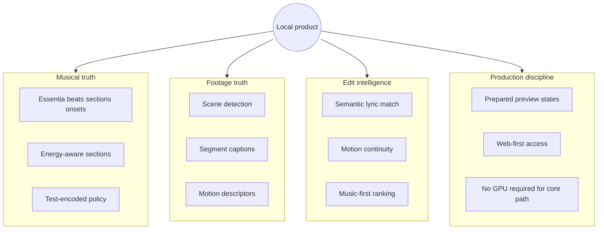

# Where We Are Stronger

**Purpose:** Honest counterbalance to reference-repo envy. The local product is not "behind" on every axis — it leads on the problem it chose to solve.

---

## The problem we own




**Reference repos optimize for generation and finishing.**  
**We optimize for correct editing of what the user already shot.**

That is a different product — and on that product, we are ahead.

---

## Strength 1 — Musical analysis spine


| Aspect                  | Local      | VRGDG            | ComfyStudio      | Inline |
| ----------------------- | ---------- | ---------------- | ---------------- | ------ |
| Authoritative beat grid | ✅ Essentia | ❌ beat snap only | ⚠️ song duration | ❌      |
| Section structure       | ✅          | ❌                | ⚠️ from SRT      | ❌      |
| Onset density for cuts  | ✅          | ❌                | ❌                | ❌      |
| Energy curve            | ✅          | ❌                | ❌                | ❌      |
| Policy in unit tests    | ✅          | ❌                | ❌                | ❌      |


Essentia-backed analysis is a **first-class product feature**, not a preprocessing step for LLM scene counting. References that split audio for scene count do not replace downbeat-aware, section-labeled musical editing.

**User benefit:** Cuts land on musical structure even when lyrics are wrong or absent.

---

## Strength 2 — Existing-footage semantic matching

Local `semanticEditPlanner` + `motionRanking`:

- Scores **real captions** against **lyric chunks** and **section prompts**
- Enforces **motion continuity** as secondary criterion (tested — cannot outrank musical alignment)
- Produces explainable `reasons[]` per assignment


| Reference   | Gap                                          |
| ----------- | -------------------------------------------- |
| VRGDG       | Generates prompts; does not rank user B-roll |
| ComfyStudio | Assumes generation fills timeline            |
| Inline      | No music/lyric concept                       |


**User benefit:** Upload 20 clips, get a musically literate first pass without running ComfyUI or paying for cloud video gen.

---

## Strength 3 — Segment-level footage understanding

Local pipeline:

1. Scene split (hosted splitter)
2. Per-segment caption (music-video-aware LFM prompts)
3. Motion descriptors (typed contract, not loose tags)
4. Rank **post-cut segments**, not whole files

References skip this because they ** synthesize** pixels. We **curate** existing pixels — harder and more valuable for editors with real footage.

**User benefit:** "Use the wide take from clip 7 for the second chorus" becomes possible; generative tools cannot see your unused B-roll.

---

## Strength 4 — Prepared preview discipline

Explicit **stale → recomputing → ready** lifecycle (`sectionRecompute.ts`):

- No fake live timeline mutation
- User trusts preview swap timing
- Pressure-pass product decision documented in roadmap

ComfyStudio/VRGDG optimize for render queue feedback; Inline for take immutability on canvas. None combine **musical section preview** with this recompute contract.

**User benefit:** Web studio feels professional — states are honest.

---

## Strength 5 — Web-first, low-friction core path


| Requirement             | Local core          | ComfyStudio         | VRGDG      | Inline     |
| ----------------------- | ------------------- | ------------------- | ---------- | ---------- |
| Install ComfyUI         | ❌ not needed        | ✅ required          | ✅ required | ✅ required |
| Local GPU for core edit | ❌                   | ✅ for gen           | ✅          | ✅ for gen  |
| Browser access          | ✅                   | ⚠️ Electron primary | ❌          | ❌          |
| Hosted analysis helpers | ✅ Essentia + FFmpeg | ❌                   | ❌          | ❌          |


The **default journey** works for editors who only have phone footage and a song — no CUDA, no custom nodes, no Electron download.

**User benefit:** Lower floor; generative lane becomes upsell, not gate.

---

## Strength 6 — Generate tab as coverage intelligence (latent strength)

Today the Generate tab is a "shell" — but the **concept** is right:

- Coverage slots derived from edit plan + cue map
- Status: filled / weak / short / missing
- Need types: b-roll, extend, bridge, alt-angle, reroll
- Locked until Story + Match produce real data

References jump straight to generation without quantifying **what existing footage already covers**.

**User benefit (when wired):** Surgical generative spend — pay GPU time only for red/purple slots.

---

## Strength 7 — Review workspace lineage

`src/review/` borrows review-room patterns:

- Media-forward cards
- Status, comments, analysis panels
- Client-facing polish potential

Neither VRGDG nor ComfyStudio optimizes for **approving a musically timed rough cut** with a reviewer who is not a ComfyUI operator.

---

## Strength 8 — License and product clarity


| Repo        | License            | Product risk                |
| ----------- | ------------------ | --------------------------- |
| Local       | Project-controlled | Clear                       |
| ComfyStudio | MIT                | Safe to learn from          |
| Inline      | MIT                | Safe to learn from          |
| VRGDG       | **AGPL-3.0**       | Cannot embed in closed SaaS |


Local codebase is **clean IP** for a hosted smart editor. References with AGPL generative stacks are research inputs, not merge targets.

---

## Strength 9 — Test-encoded product law

```bash
bun run test  # motionRanking, semanticEditPlanner, musicVideoProject
```

Product rules are **executable tests**, not README promises:

- Musical alignment beats motion continuity
- Semantic scoring reasons are stable
- Project contracts serialize predictably

Reference repos rely on manual QA in ComfyUI graphs — fragile at scale.

---

## Strength 10 — Strategic focus (scope control)

Roadmap non-negotiables protect us from becoming a worse ComfyStudio:

1. Not a full NLE
2. Not a ComfyUI wrapper
3. Reference repos inform capabilities; this repo is source of truth
4. Web-first until benchmark says otherwise

**Strength:** Shippable milestones. ComfyStudio's ~95% complete NLE is years of surface area; our MVP is narrower and achievable.

---

## Honest weaknesses (not strengths)

Acknowledged gaps — see other docs for remediation:


| Gap                             | Best donor              |
| ------------------------------- | ----------------------- |
| No ComfyUI queue                | ComfyStudio + Inline    |
| No multi-stage LLM prompts      | VRGDG + CS Director     |
| No lip-sync/I2V                 | CS LTX shot workflow    |
| No full timeline NLE            | ComfyStudio (defer)     |
| No canvas/takes experimentation | Inline (optional later) |


We are weaker **where we chose not to compete yet**.

---

## Positioning statement

> **ComfyStudio and VRGDG help you make shots. We help you place the shots you already have — and only generate what's missing — on beat.**

Use this when prioritizing backlog: anything that improves **musical placement of real footage** outranks feature parity with generative references.

---

## When references are strictly ahead

Use them when the user story is:


| User story                                                      | Lead with           |
| --------------------------------------------------------------- | ------------------- |
| "I have a song and a character ref, no footage"                 | ComfyStudio / VRGDG |
| "I want to experiment with Comfy graphs visually"               | Inline Studio       |
| "I have hours of B-roll and one track"                          | **Local product**   |
| "I need a client-ready multi-track master today"                | ComfyStudio         |
| "I need a beat-accurate rough cut from my clips this afternoon" | **Local product**   |


---

## Morale checklist for the team

Before assuming catch-up is required, verify:

1. ✅ Can we beat-match and section-label faster than manual NLE? **Yes — core value.**
2. ✅ Do we rank clips to lyrics without GPU? **Yes.**
3. ✅ Can a non-Comfy user complete the core loop? **Yes.**
4. ❌ Can we one-click generate a full MV? **No — intentionally.**
5. ⚠️ Can we fill a 3-second gap with AI? **Not yet — planned lane.**

Items 1–3 are the company; 4–5 are optional expansion.

---

## Related documents

- [local-codebase-summary.md](./local-codebase-summary.md)
- [cross-repo-comparison.md](./cross-repo-comparison.md)
- [recommended-workflow-changes.md](./recommended-workflow-changes.md)

